# UI redesign 2: from consistent to good

The [first redesign](ui-redesign.md) (TP-440) gave the Mac app a design system: tones, chips,
sections, one inspector, a Today page, ⌘K. The app is consistent now, but some of it is still well
below the quality we aim for. The job description is the clearest case: one block of plain text at
the bottom of a 420 pt column, under two lists of facts. This document plans the next pass, at four
levels, from the patterns down to single sections, and splits it into sub-tickets of TP-659. Nothing
in the apps changes with this document.

The mockups in `mockups-2/` are drawn by SwiftUI, offscreen, with made-up companies, jobs and
people. The *Today* pictures redraw the current views from their code; the *Proposed* ones use the
app's own tokens (`DesignSystem/Tokens.swift`):

```bash
docs/design/mockups-2/render.sh docs/design/mockups-2            # every image
docs/design/mockups-2/render.sh docs/design/mockups-2 job-page   # one of them
```

| Mockup | What it shows | Level | Tickets |
|---|---|---|---|
| [`patterns.png`](mockups-2/patterns.png) | The twelve patterns, each with what it's for and what it replaces | Patterns | TP-668 and all |
| [`shell-before-after.png`](mockups-2/shell-before-after.png) | The Jobs page with a job open, today and proposed: the page header, the rows, the sidebar's foot | Shell | TP-668, TP-673 |
| [`job-page.png`](mockups-2/job-page.png) | A job opened as a page: outline, posting, and the decision's cards on a rail | Shell, pages | TP-671 |
| [`decide.png`](mockups-2/decide.png) | Decide as a narrow queue beside the job's page | Pages | TP-672 |
| [`pipeline-before-after.png`](mockups-2/pipeline-before-after.png) | Pipeline's board and cards, today and proposed | Pages | TP-674 |
| [`companies-before-after.png`](mockups-2/companies-before-after.png) | The Companies table, today and proposed | Pages | TP-675 |
| [`posting-before-after.png`](mockups-2/posting-before-after.png) | The job description, today and proposed, and the server change under it | Sections | TP-667, TP-669 |
| [`job-overview-before-after.png`](mockups-2/job-overview-before-after.png) | The job inspector's header and Overview tab, today and proposed | Sections | TP-670 |
| [`criteria-settings-before-after.png`](mockups-2/criteria-settings-before-after.png) | The Criteria page today and proposed, and Settings as status rows | Sections | TP-676 |
| [`journeys.png`](mockups-2/journeys.png) | Four user stories, each followed screen by screen | All | all |
| [`decisions.png`](mockups-2/decisions.png) | Four decisions and the options weighed for each | All | all |
| [`rollout.png`](mockups-2/rollout.png) | The ten sub-tickets in landing order, each with its mockup | All | all |

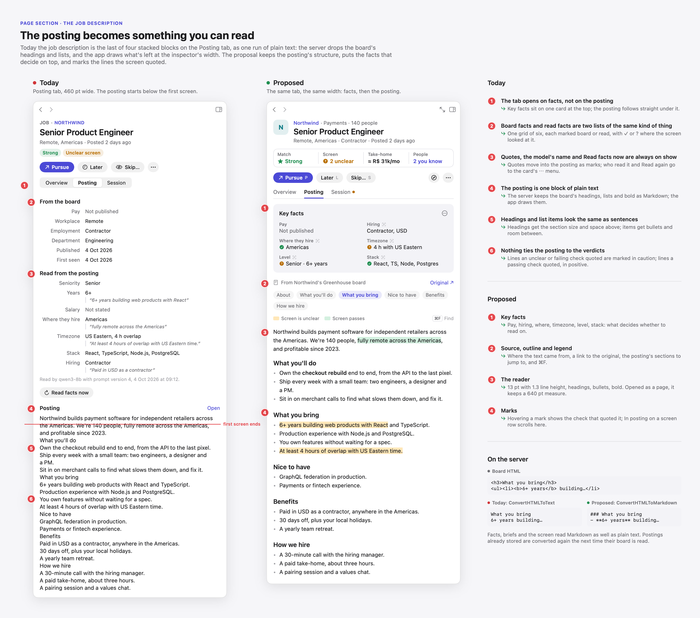

## What's still wrong

The first redesign fixed what was inconsistent: colors, words, where an entity opens. What's left is
mostly about **reading and deciding**, which is what the app is for:

1. **Long text is never treated as text.** The server flattens each board's HTML to plain text
   (`convertHTMLToText` in `server/internal/jobboards/postings.go`), so a posting loses its headings,
   lists and bold before it's stored. The Mac app then draws it as one `Text` at the inspector's
   width, under *From the board* and *Read from the posting*. At 860 pt, the first screen ends two
   lines into the posting.
2. **The inspector is the only detail view.** It's 360–720 pt beside a list: right for triage, wrong
   for reading a posting, preparing a CV or working in a session. Decide, the page where every job
   needs its posting, shows it a tab away.
3. **Details read as documents.** The Overview tab stacks a paragraph, two lists, six screen rows of
   equal weight and plain-text people. The two screen checks that matter sit among four that pass.
4. **Page controls live in three places.** The window toolbar (Companies, People, Profile, Model
   lab), a right-aligned icon bar (`PageBar` on Jobs and Pipeline), or nowhere. Filters hide in a
   popover, so you can't see what's on. The toolbar moved off Jobs and Pipeline for a good reason:
   items there reach over the inspector and looped AppKit's layout (#66, #71).
5. **Rows say too little, cards say too much.** A Jobs row is one line of equal columns with the
   screen first, and no match or pay; a Companies row lists the domain and the date you started
   watching, but not the company's open jobs. A Pipeline card can carry seven lines in five colors.
6. **Forms are settings forms.** Criteria, which decide what every page shows, are eleven
   comma-separated text fields under one heading, with Save at the end of the second group.
   Settings' sections each carry a paragraph of footer.
7. **The hub's own state has no home.** Nothing in the window says whether the hub is connected or
   what the local models are doing, while three to eight sessions fill the sidebar's foot.

## Level 1: UI patterns

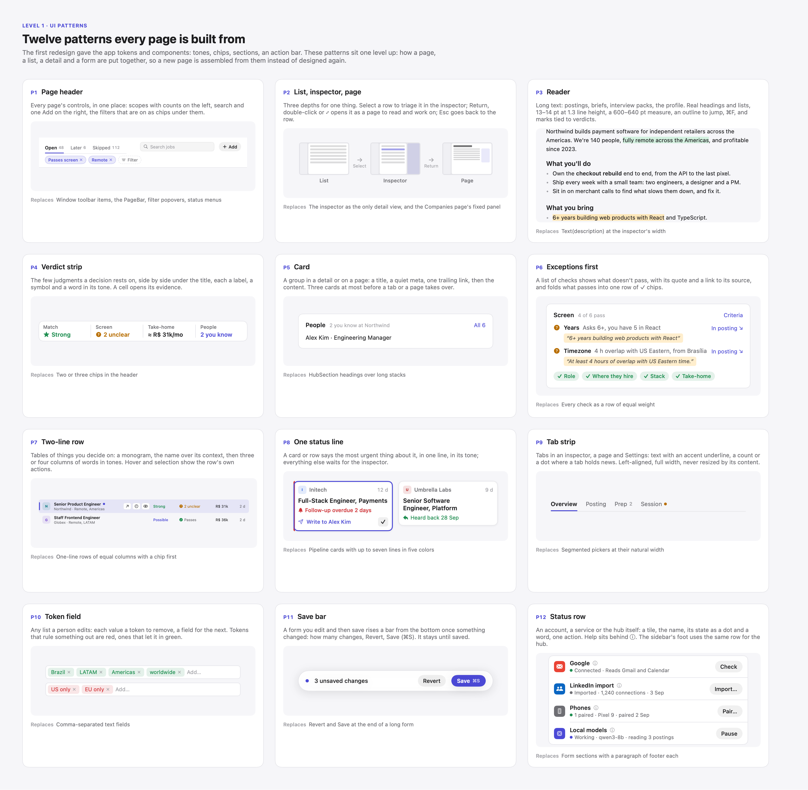

The first redesign's components (`ToneChip`, `HubSection`, `VerdictRow`, `ActionBar`…) stay. These
patterns sit one level up: how a page, a list, a detail and a form are put together. A new page is
assembled from them rather than designed again.

| # | Pattern | Use it for | Replaces |
|---|---|---|---|
| P1 | **Page header** | Every page's controls: scopes with counts on the left, search and one Add on the right, the filters that are on as removable chips under them, *+ Filter* to add one | Window toolbar items, `PageBar`, filter popovers, status menus |
| P2 | **List, inspector, page** | Three depths for one thing: select a row to triage it in the inspector; Return, double-click or ⤢ opens it as a page; Esc goes back to the row | The inspector as the only detail view |
| P3 | **Reader** | Long text: postings, briefs, interview packs, the profile. Real headings and lists, 13–14 pt at 1.3 line height, a 600–640 pt measure on a page, an outline, ⌘F, marks tied to verdicts | `Text(description)` at the column's width |
| P4 | **Verdict strip** | The few judgments a decision rests on, side by side under the title: a label, a symbol and a word in its tone. A cell opens its evidence | Two or three chips in a header |
| P5 | **Card** | A group in a detail or on a page: title, quiet meta, one trailing link, content. Three cards at most before a tab or a page takes over | `HubSection` headings over long stacks |
| P6 | **Exceptions first** | A list of checks shows what doesn't pass, with its quote and a link to its source, and folds what passes into one row of ✓ chips | Every check as an equal row |
| P7 | **Two-line row** | Tables of things you decide on: monogram, name over context, three or four columns of words in tones, the row's own actions on hover | One-line rows of equal columns |
| P8 | **One status line** | A card or row says the most urgent thing about it, in one line, in its tone; the rest waits for the inspector | Cards with a line per fact |
| P9 | **Tab strip** | Tabs in an inspector, a page or Settings: text with an accent underline, a count or a dot for news, left-aligned, never resized by content | Segmented pickers at their natural width |
| P10 | **Token field** | Any list a person edits: a token per value with ×, a field for the next. Tokens that let something in are positive, ones that rule it out negative | Comma-separated text fields |
| P11 | **Save bar** | A form you edit then save: a bar rises from the bottom once something changed, with the count, Revert and Save (⌘S) | Revert and Save at the end of a form |
| P12 | **Status row** | An account, a service or the hub: a tile, the name, its state as a dot and a word, one action, help behind ⓘ | Form sections with a paragraph of footer |

Rules that come with them:

- **Reading width.** Text you read never runs wider than 640 pt; text in a 420 pt inspector uses the
  column. Wider pages give the rest to a rail, not to the line length.
- **Color never stands alone** (unchanged): every status has a word and a symbol, and every mark in
  the reader has a legend and a tooltip.
- **One primary action per view** (unchanged), and its key is shown on the button (*Pursue P*).
- **Undo over asking.** Skip, Later and Pursue act at once and show a toast with Undo, as Android
  already does (#57). A reason can be added from the toast.
- **No layout that follows content width in a split view column.** The inspector and the page
  header keep constant sizes, as the fixes in #54, #66 and #71 require.

## Level 2: the app shell

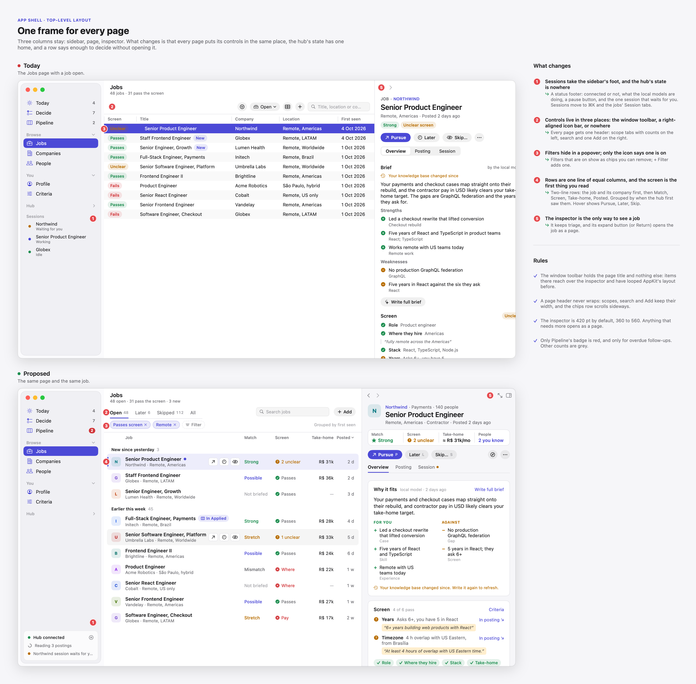

The window keeps its three columns: sidebar, page, inspector. What changes:

- **The window toolbar holds the page's title and subtitle, nothing else.** Every page's controls
  are in its page header (P1), in the content column. That's where `PageBar` already put Jobs' and
  Pipeline's controls to keep them off the inspector; the header gives that spot room for scopes,
  search, Add and filter chips.
- **The sidebar's foot is the hub's status** (P12): connected or not, what the local models are
  doing, Pause, and the session that waits for you. Clicking it lists the running and recent
  sessions, which leave the sidebar. Sessions also stay on each job's and company's Session tab, and
  in ⌘K.
- **Badges.** Only Pipeline's badge is red, and only when a follow-up is overdue. Other counts are
  grey numbers.
- **The inspector** is 420 pt by default, 360 to 560, and has a ⤢ button beside its close button.
  Anything that needs more width opens as a page (P2).
- **A page** replaces the list in the content column, with a top bar: *‹ Jobs / title*, the list's
  position (*3 of 48*), ↑ and ↓ for the list's next and previous, and collapse. Esc or ⌘[ goes back
  to the list with its selection and scroll kept. The first page is a job's (TP-671); a company's
  and a person's follow the same pattern later.

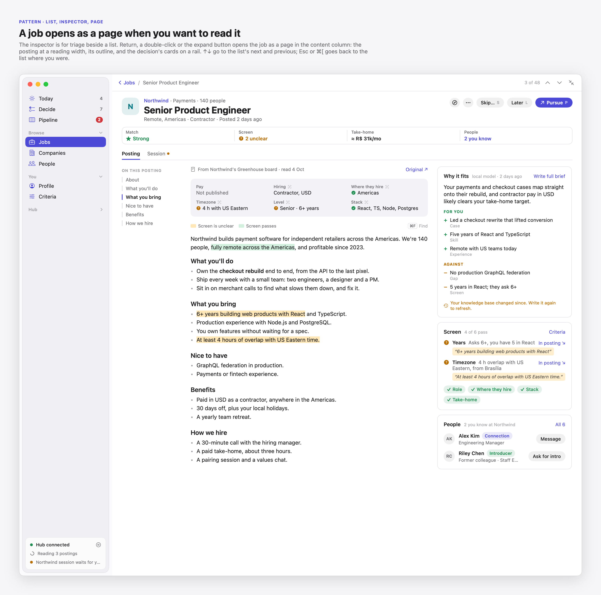

## Level 3: pages

### Decide

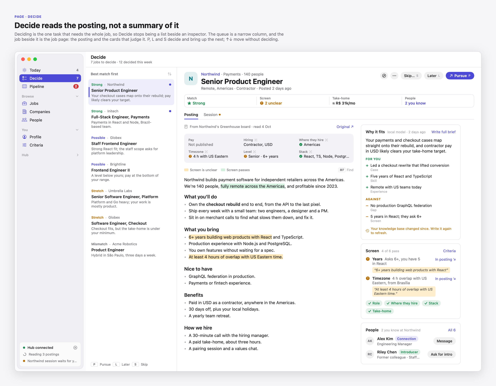

Deciding is reading, so Decide stops being a list beside an inspector. The queue becomes a 300 pt
column (match word, company, title, the brief's one-line reason) and the selected job's page fills
the rest: key facts, the posting, and *Why it fits*, *Screen* and *People* on the rail. P, L and S
decide and bring up the next, with Undo; ↑↓ move without deciding. (TP-672)

### Jobs

Jobs gets the page header (scopes Open, Later, Skipped, All; filters as chips) and two-line rows
(P7): the title over *company · location*, then **Match**, **Screen**, **Take-home** and
**Posted**. Sorted by Posted, rows group under *New since yesterday* and *Earlier this week*. Hover
shows Pursue, Later and Skip; P, L and S act on the selection with Undo. The optional columns stay
in the Columns menu. (TP-668, TP-673)

### Pipeline

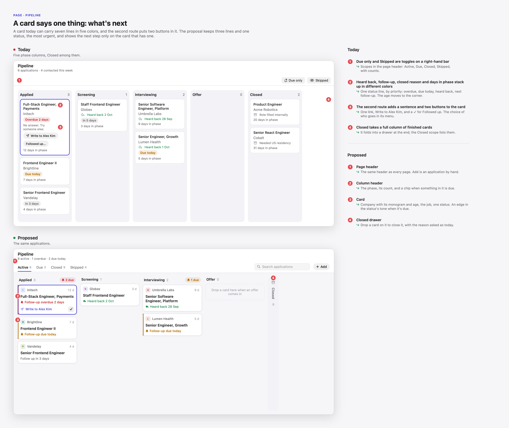

A card keeps three lines and one status (P8): the company with its monogram and the days in phase,
the job, and the most urgent of *overdue*, *due today*, *heard back*, *next follow-up*. A due card is
edged in its tone. The second route becomes one line on an overdue card, *Write to Alex Kim*, with a
✓ for *Followed up…*. Column headers count what's due. Closed folds into a drawer at the board's
end; the Closed scope lists its cards. (TP-674)

### Companies

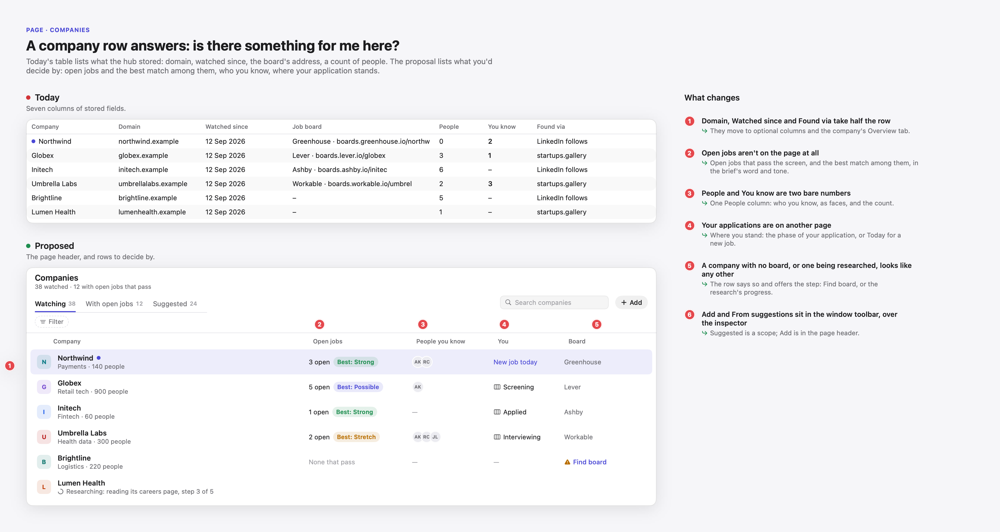

A row answers *is there something for me here?*: open jobs that pass the screen and the best match
among them, who you know (as faces), where your application stands, and whether the hub found a
board (*Find board* when it didn't). Research in progress shows in its row. Domain, Watched since
and Found via become optional columns; the suggestions sheet becomes a *Suggested* scope. The
server's company list gains the fields this needs. (TP-675)

### Criteria and Settings

See [Criteria and Settings forms](#criteria-and-settings-forms) below.

### The rest

Today, People, Profile, Activity, Prompts and Model lab get the page header and the tab strip
(TP-668) and keep their layouts. Today's cards already follow P5; People's table follows P7 once
TP-673 builds the row; Profile's document follows P3 once TP-669 builds the reader. Those two
follow-ups are small enough to file when their patterns exist.

## Level 4: page sections

### The job description

The headline of this pass, pictured at the top of this document.

**On the server (TP-667).** Board adapters convert HTML to Markdown instead of plain text: headings
become `###`, list items `- `, bold `**…**`. The poll already rewrites a job's description, so
stored postings convert on their next poll. Fact and screen evidence stays plain words. Until the
reader lands, both clients draw the Markdown's headings, bullets and bold so no raw markup shows.

**In the app (TP-669).** The Posting tab becomes:

1. **Key facts**, one card: Pay, Hiring, Where they hire, Timezone, Level, Stack. Each says whether
   it came from the board or was read from the posting, and shows ✓ or ? where the screen judged
   it. Who read them and *Read facts again* move to the card's ⋯ menu. This replaces *From the
   board* and *Read from the posting*.
2. **Source and outline**: the board it came from, *Original ↗*, the posting's headings as chips to
   jump to, a legend for the marks, and ⌘F.
3. **The reader** (P3): headings, bullets and bold, 13 pt at 1.3 line height in the inspector and
   14 pt at a 600–640 pt measure on a page.
4. **Marks**: phrases quoted by an unclear or failing screen check in the caution tone, by a passing
   check in the positive tone. Hovering a mark names the check and its reason; *In posting* on a
   screen row scrolls to it.

### The job inspector

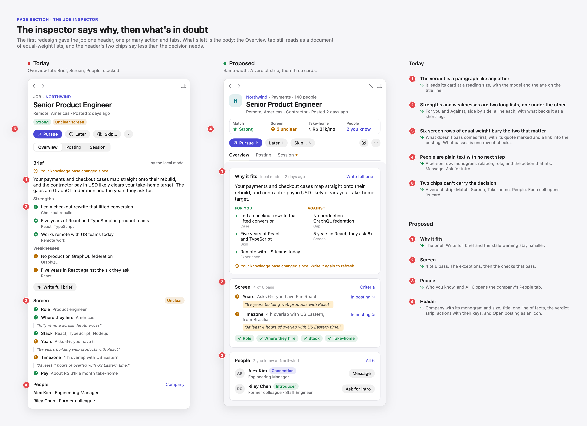

**Header.** The company's monogram, name (a link), industry and size; the title; one line of facts.
Then the **verdict strip** (P4): Match, Screen, Take-home, People. Then the actions with their keys,
and *Open posting* as an icon.

**Overview (TP-670)** is three cards:

- **Why it fits**: the brief's verdict at reading size, *For you* and *Against* side by side with a
  short tag for what backs each, *Write full brief* in the title row.
- **Screen** (P6): *4 of 6 pass*; the unclear and failing checks first, each with its quote and *In
  posting*; the passing ones as one row of ✓ chips.
- **People**: a row per person with a monogram, relation, role and the action that fits (*Message*,
  *Ask for intro*).

Prep (CV, interview pack) and Session keep their content and get the tab strip.

### Tabs

The tab strip (P9) replaces every segmented picker used as tabs: the inspector's Overview, Posting,
Prep and Session; Profile's five tabs; Criteria's scopes. A dot marks a tab with news (a session
waiting for you), a count a tab with items (*Prep 2*). (TP-668)

### Tables

Jobs and Companies use the two-line row (P7). Shared rules: 44 pt rows; a monogram first; the name in
semibold over its context; status columns as a word in its tone with a symbol, not a chip;
numbers right-aligned with tabular digits; ages as *2 d*, *1 w*; no zebra stripes; the selected row
in a light accent fill with an accent edge; actions on hover. (TP-673, TP-675)

### Criteria and Settings forms

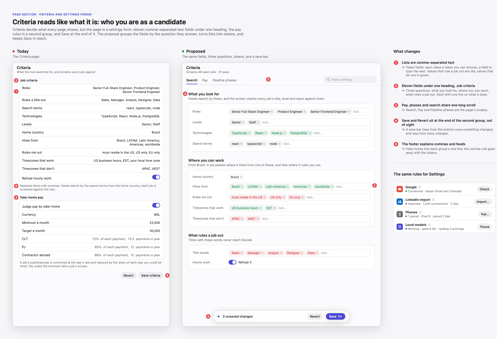

Criteria's scopes are **Search**, **Pay** and **Pipeline phases**. Search groups its fields by the
question they answer, each with one line of help: *What you look for* (roles, levels, technologies,
search terms), *Where you can work* (home country, hires from, rules me out, timezones), *What rules a
job out* (title words, hourly work). Every list is a token field (P10), green where it lets a job
in, red where it rules one out. The save bar (P11) rises once something changed.

Settings keeps its tabs, and each account or service becomes a status row (P12): Google, LinkedIn
import, phones, local models, the server. Footer paragraphs move behind ⓘ. (TP-676)

## User stories and screen journeys

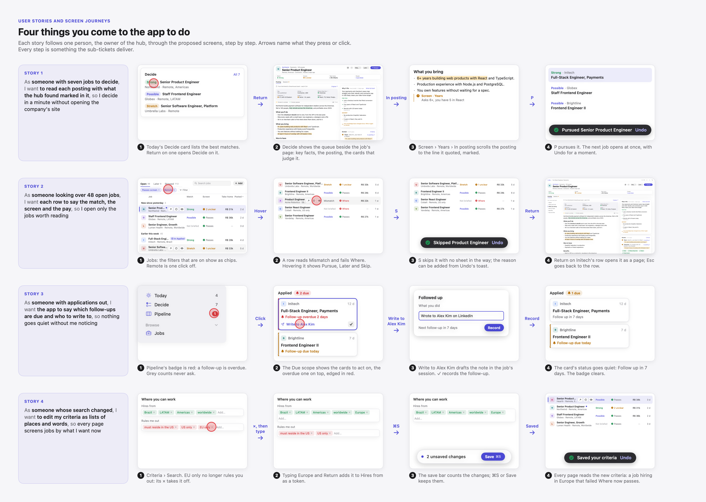

1. **As someone with seven jobs to decide**, I want to read each posting with what the hub found
   marked in it, so I decide in a minute without opening the company's site.
   Today › Decide card → Return → Decide with the job's page → *In posting* on Years → the quoted
   line, marked → P → the next job, with Undo.
2. **As someone looking over 48 open jobs**, I want each row to say the match, the screen and the
   pay, so I open only the jobs worth reading.
   Jobs with filter chips → hover a *Mismatch · ✗ Where* row → S → skipped with Undo → Return on
   another row → its page.
3. **As someone with applications out**, I want the app to say which follow-ups are due and who to
   write to, so nothing goes quiet without me noticing.
   Pipeline's red badge → the Due scope → *Write to Alex Kim* → ✓ *Followed up* → the card goes
   quiet and the badge clears.
4. **As someone whose search changed**, I want to edit my criteria as lists of places and words, so
   every page screens jobs by what I want now.
   Criteria › Search → × on *EU only* → type *Europe* in Hires from → ⌘S → a job hiring in Europe
   now passes on Jobs.

## Decisions

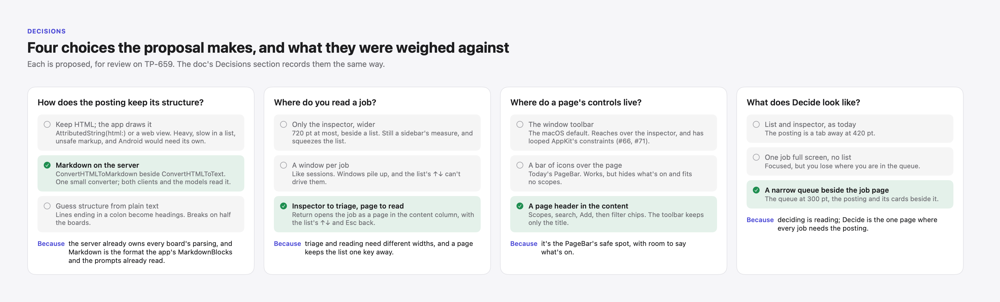

Proposed, for review on TP-659:

| Question | Chosen | Weighed against | Because |
|---|---|---|---|
| How does a posting keep its structure? | Markdown, converted on the server | HTML drawn by the app (`AttributedString(html:)` or a web view); guessing structure from plain text | The server already parses every board, and the app (`MarkdownBlocks`) and the prompts already read Markdown. Android gets it for free. |
| Where do you read a job? | The inspector to triage, a page to read | A wider inspector; a window per job | Triage and reading need different widths, and a page keeps the list one key away. |
| Where do a page's controls live? | A page header in the content column | The window toolbar; today's icon bar | The toolbar reaches over the inspector and looped the layout; the icon bar can't say what's on. |
| What does Decide look like? | A narrow queue beside the job's page | List and inspector; one job full screen | Every job in Decide needs its posting, and the queue must stay in view. |

## Rollout

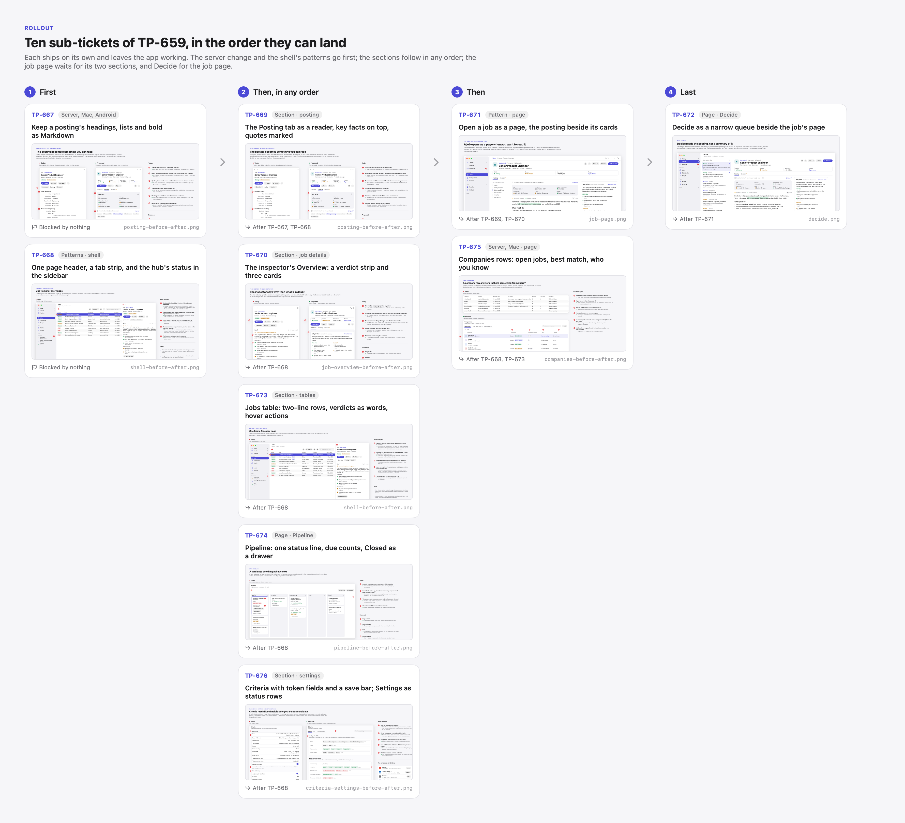

Each sub-ticket ships on its own and leaves the app working. They're in Backlog until this plan is
approved.

| Order | Ticket | Blocked by | Level | Mockups |
|---|---|---|---|---|
| 1 | TP-667 Server, macOS and Android: keep a posting's headings, lists and bold as Markdown | none | Section | posting |
| 1 | TP-668 macOS: one page header on every page, a tab strip, and the hub's status at the sidebar's foot | none | Patterns, shell | shell, patterns |
| 2 | TP-669 macOS: the Posting tab as a reader, with key facts on top and the screen's quotes marked | TP-667, TP-668 | Section | posting |
| 2 | TP-670 macOS: the job inspector's Overview as a verdict strip and three cards | TP-668 | Section | job overview |
| 2 | TP-673 macOS: Jobs table with two-line rows, the verdicts as words, and actions on hover | TP-668 | Section, page | shell, journeys |
| 2 | TP-674 macOS: Pipeline cards with one status line, due counts per phase, and Closed as a drawer | TP-668 | Page | pipeline |
| 2 | TP-676 macOS: Criteria as three questions with token fields and a save bar, and Settings as status rows | TP-668 | Section | criteria and settings |
| 3 | TP-671 macOS: open a job as a page, with the posting beside the cards that judge it | TP-669, TP-670 | Shell, page | job page |
| 3 | TP-675 Server and macOS: Companies rows that show open jobs, the best match, who you know and where you stand | TP-668, TP-673 | Page | companies |
| 4 | TP-672 macOS: Decide as a narrow queue beside the job's page | TP-671 | Page | decide |

## Out of scope, for later

- **Android.** TP-667 keeps the phone from showing raw Markdown and draws headings and bullets. The
  phone's job screen getting key facts, marks and the verdict strip is a follow-up once TP-669 and
  TP-670 settle the shape.
- **A company and a person as pages.** P2 covers them; TP-671 builds it for jobs first.
- **People as two-line rows and Profile as a reader**, once TP-673 and TP-669 build those patterns.

## Open questions for review

- **Sessions out of the sidebar.** The proposal moves them into the hub status footer's popover,
  each job's Session tab and ⌘K. The alternative keeps a short Sessions section under the groups.
- **Skip without asking.** Undo with *Add reason* replaces the reason sheet on Jobs and Decide. The
  reason stays optional, as it is today.
- **Decide without an inspector.** It's the one page that leaves the list-and-inspector layout. If
  that feels inconsistent, Decide can open on the inspector and expand to the page on Return like
  every other list.
