# UI redesign: evaluation and proposal

A review of both clients as they stand, and a proposal for a design system and information
architecture to fix what it finds. Nothing in the apps changes with this document. The work it
proposes is split into tickets at the end.

The mockups in `mockups/` are drawn by SwiftUI from `mockups/render.swift`, with made-up companies,
jobs and people:

```bash
swift docs/design/mockups/render.swift docs/design/mockups
```

The Android mockups use Roboto and Material Symbols Rounded. Install Roboto, and point
`MATERIAL_SYMBOLS_FONT` at `MaterialSymbolsRounded[FILL,GRAD,opsz,wght].ttf` from the `variablefont/`
folder of [google/material-design-icons](https://github.com/google/material-design-icons). Without the
font file, SF Symbols stand in for the icons.

## Mockups

Every rollout ticket has at least one picture of what it delivers. The before pictures redraw
today's views from their code (`JobDetailView`, `PipelineCardView`, Android's `JobScreen`), with
the same sections, buttons and colors.

| Mockup | What it shows | Tickets |
|---|---|---|
| [`rollout.png`](mockups/rollout.png) | The twelve tickets, their order and blocked-by links, each with its mockup | all |
| [`design-board.png`](mockups/design-board.png) | Icon, tones, type, space, chips, actions, verdicts, feedback, connection banner | TP-449, TP-457 |
| [`macos-job-before-after.png`](mockups/macos-job-before-after.png) | Today's job detail beside the proposed inspector, with seven problems and their fixes | TP-449, TP-450, TP-452 |
| [`macos-vocabulary.png`](mockups/macos-vocabulary.png) | A pipeline card before and after, and the old and new word for each concept | TP-450 |
| [`ia-map.png`](mockups/ia-map.png) | Where a job, a company and a person open, today and proposed | TP-451, TP-452 |
| [`macos-sidebar.png`](mockups/macos-sidebar.png) | The sidebar today and grouped by intent | TP-451 |
| [`macos-settings-criteria.png`](mockups/macos-settings-criteria.png) | The Criteria page, the Settings window, the connection banner, and where each Settings section goes | TP-451 |
| [`macos-inspector.png`](mockups/macos-inspector.png) | The inspector's anatomy, numbered | TP-452 |
| [`macos-company-person.png`](mockups/macos-company-person.png) | A company with its new Jobs tab, and a recruiter's conversation, in the same inspector | TP-452 |
| [`macos-people.png`](mockups/macos-people.png) | The People page with a person open | TP-453 |
| [`macos-today.png`](mockups/macos-today.png), [`macos-today-dark.png`](mockups/macos-today-dark.png) | The main window on Today, light and dark | TP-454 |
| [`macos-palette.png`](mockups/macos-palette.png) | ⌘K over Today, and the keyboard decisions | TP-455 |
| [`android-components.png`](mockups/android-components.png) | Each shared component as Material 3 Expressive builds it, and the iOS habit it replaces | TP-456 |
| [`android-job-before-after.png`](mockups/android-job-before-after.png) | Today's job screen in wallpaper colors beside the Material 3 one | TP-456 |
| [`android.png`](mockups/android.png) | Android Today, Job, Pipeline and Settings | TP-456, TP-458 |
| [`android-system.png`](mockups/android-system.png) | Notifications with actions, the *Followed up…* bottom sheet, a snackbar with Undo, predictive back | TP-458, TP-462 |
| [`android-foldable.png`](mockups/android-foldable.png) | A navigation rail and list-detail panes on an unfolded Galaxy Z Fold, and dark theme | TP-463 |

## Summary

The features are good, and the app grew one feature at a time, which shows. Each feature got its
own page, panel, colors, words and error handling, so the same job, company or person looks and
behaves differently depending on where you meet it. The two worst problems:

1. **Nothing answers "what should I do now?"** Jobs to decide, follow-ups due, replies, fresh
   matches and recruiters waiting live on five pages, and the app opens on Pipeline.
2. **An entity has no home.** A job opens in the window inspector from Decide, Jobs and Pipeline.
   From Updates it switches you to the Jobs page. A company opens in a fixed side panel that isn't
   the inspector, and a recruiter in a third panel. Company and job don't link to each other on
   the Mac.

The proposal has three parts:

- **A design system.** One accent, four semantic tones, a type ramp, a 4-point spacing scale,
  three radii, and about ten shared components. Both clients share the meaning; each builds it
  the way its platform does: macOS with AppKit and SwiftUI conventions, Android with Material 3
  Expressive and Samsung's One UI guidance.
- **An information architecture.** A Today page, a sidebar grouped by intent, one inspector for
  every entity with history and cross-links, a People page, Criteria out of Settings, and a ⌘K
  palette.
- **One vocabulary.** One word per concept on both clients: *Skip* replaces Dismiss and Not a
  good fit, *Screen* replaces Fit, and *Match* stays the brief's verdict.

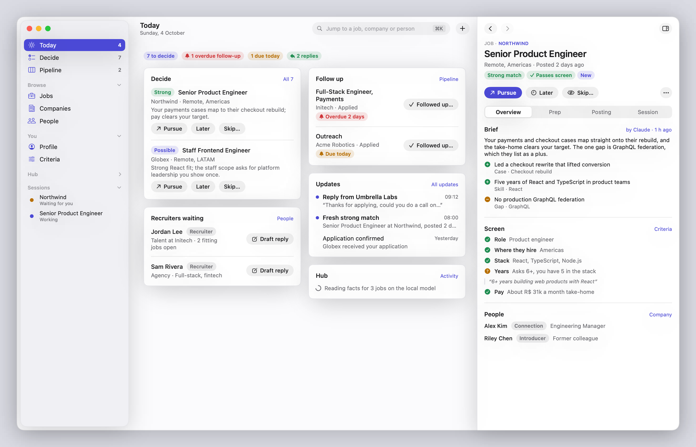

## What's there today

### macOS (`macos/Sources/JobSearchHub`)

| Page | What it does | Detail pattern |
|---|---|---|
| Decide | Briefed jobs to decide, best match first | Window inspector |
| Pipeline | Kanban of applications by phase; follow-ups, dismiss, close | Window inspector |
| Updates | Mail replies, matches, follow-ups due, by day | Switches to Jobs or Companies |
| Jobs | Table of every job, filters, columns, bulk actions | Window inspector |
| Companies | Watch list table and dossier | Fixed 460 pt side panel with a Details/Session switch |
| Recruiters | LinkedIn conversations started by recruiters | Page-level inspector |
| Profile | Profile document, knowledge base, market gaps, LinkedIn, answers | One long scroll |
| Prompts | Versioned agent prompts | List beside an editor |
| Compare | Model comparisons with verdicts | `HSplitView` |
| Runs | Local model queue, run stats, latest runs | One long scroll |
| Settings | Hub, status, server, sessions, Google, network, job criteria, take-home pay, pipeline phases, phones, models | One grouped form, 11 sections |

The sidebar also lists the eight latest Claude sessions.

### Android (`android/app/.../ui`)

Pair, then a bottom bar with Decide, Updates and Jobs. A job and a company open full screen.
There's no pipeline, and unpairing is an icon in the Updates top bar.

## Evaluation

The scores run from 1 (poor) to 5 (great) for **polish** (looks finished and consistent) and
**clarity** (easy to know what it is and what to do).

| Screen | Polish | Clarity | The honest take |
|---|---|---|---|
| Decide | 4 | 4 | The best screen: one queue, one job at a time, decisions bring up the next. Loses points for a raw signal summary as the first row and no keyboard decisions. |
| Pipeline | 3 | 3 | Drag and drop and phase columns work. A card can carry seven lines in five colors (title, company, heard back, follow-up, closed reason, dismissal, days in phase), and "Not a good fit" and "Close" are two ways out that read alike. |
| Updates | 3 | 2 | A clean list, but opening an update throws you onto the Jobs or Companies page, so you lose your place. It overlaps Decide (fresh matches) and Pipeline (follow-ups due). |
| Jobs | 3 | 3 | A powerful table: columns, filters and saved sort. The toolbar holds seven controls, mixing view controls (Filters, Status, Columns) with actions (Add by URL, Generate missing CVs, Refresh). Two verdicts (Fit, and Match in the inspector) sit side by side. |
| Job detail | 2 | 2 | Up to eleven stacked sections: header, actions, brief, CV, interview pack, screen-out checks, people, fit, board facts, read facts, posting. Five action buttons have equal weight. The brief and the screen-out checks repeat what Fit says, and there's no link to the company. |
| Companies | 2 | 2 | Its own panel instead of the inspector, so the toolbar and width behave unlike every other page. The dossier lists applications and mail but not the company's open jobs, which the phone shows. Four kinds of people (People, People you know, Can introduce you, plus recruiters elsewhere) sit in four sections. |
| Recruiters | 3 | 3 | Useful, but it's a page about people that only knows recruiters; contacts and introducers live on company pages. |
| Profile | 2 | 2 | Five unrelated things in one scroll: the profile document, knowledge base, market gaps, LinkedIn with its audit, and application answers. Headings use three different styles. |
| Prompts, Compare, Runs | 3 | 3 | Fine as tools, but they're the hub's own maintenance, and they sit in the main navigation at the same level as Decide. |
| Settings | 2 | 1 | Eleven sections in one form. Job criteria, take-home pay and pipeline phases shape the whole search, and they're buried between the Keychain token and server start and stop. LinkedIn import lives here, but its results show on four other pages. |
| Android | 3 | 3 | Material 3 components, but no design on top: dynamic color takes the wallpaper's palette and the tones are hard-coded hex, the job screen is one long scroll with five equal buttons at the top, out of thumb reach, and notifications have no actions. Follow-up reminders land on a phone with no pipeline. "Research a company" sits on the Jobs bar, and unpair on the Updates bar. Unfolded on a Fold or a tablet, it stretches one column across the screen. |

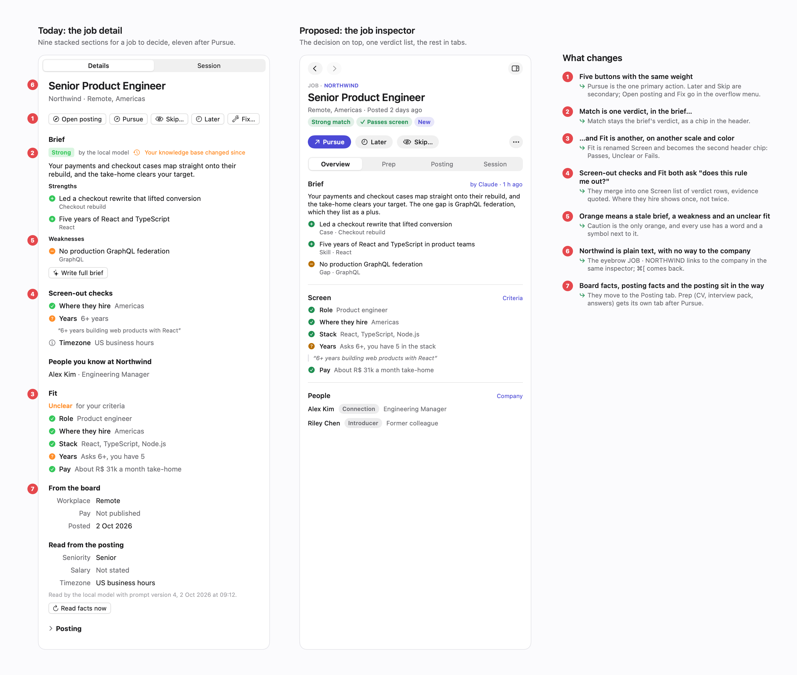

### Polish: what's inconsistent

Measured in `macos/Sources/JobSearchHub`:

- **Color has no meaning.** There are 89 direct uses of `.green`, `.orange`, `.red`, `.blue` or
  `accentColor`, and Android hard-codes `0xFF2E9E4F`, `0xFFD08A00` and `0xFF3B7DD8`. Orange
  means unclear fit, stretch match, weakness, due today, dismissed, any warning, paused, a session
  waiting for you, and a criteria mismatch. A poor fit is grey on the Mac and red on Android.
- **No identity.** The Mac app has no icon (`make-app.sh` sets no `CFBundleIconFile`) and uses the
  system accent. Android's icon is a briefcase on `#2F6FEB`, and its colors follow the wallpaper.
- **Status words are drawn four ways:** the "New" pill (accent at 20%), the "Agency" pill
  (`.quinary`), `MatchLabel` (tone at 18%), and `FitLabel` (colored text with no background).
  "Later" is a bare caption.
- **Spacing and shape drift.** Stacks use 14 different spacings (0, 1, 2, 3, 4, 6, 8, 10, 12, 14,
  16, 20, 24, 28), paddings use more than 20 values, and corner radii are 4, 6, 8 and 10.
- **Headings drift.** Sections use `.headline`, `.title3.weight(.semibold)`, `.title3.bold()` and
  `.subheadline.weight(.semibold)`. Four pages each define their own private `section()` helper.
- **Errors are raw and appear five ways.** 45 places show `String(describing: error)`, the Swift
  debug description, as text. They appear as alerts, red text, orange labels, overlays or toasts.
- **The not-connected state takes over each page.** Ten pages share one `NotConnectedView`, but
  each one swaps its whole content for it, rather than the window showing one banner.
- **Refresh buttons on seven pages** even though the hub's event stream already refreshes them.
  The buttons suggest the live updates can't be trusted.
- **Busy states are hand-made** each time: "Writing…", "Reading…", "Drafting…", "Printing…",
  "Fixing…", each with its own `ProgressView` placement.
- **Little accessibility.** Only 19 lines in the app set accessibility labels, and 11 of them are in
  the Models settings. Fit, match and due state rely on color alone in the tables.
- **Small code smells** worth fixing while restyling: `PipelinePage.swift` has a stray
  `@ViewBuilder` and two doc comments on one property, `JobDetailView.swift` has a doc comment for a
  view that isn't under it, and `JobsPage.describeCounts`'s comment sits on `generateMissingCVs`.

What's already good, and the proposal keeps it: standard macOS containers (`NavigationSplitView`,
`Table`, inspector), `ContentUnavailableView` empty states with real explanations, careful
plain-language copy, persisted table columns, sort and filters, live updates over SSE, and a
decision flow that brings up the next job.

### Information architecture and UX: what's tangled

1. **No home.** The day starts by visiting Decide (to decide), Pipeline with *Due only* (to follow
   up), Updates (replies), Recruiters with *Unanswered* (people waiting) and notifications (fresh
   matches). The Mac opens on Pipeline and the phone on Decide.
2. **One flat list of 11 pages.** Daily work, browsing, the owner's own data and the hub's
   maintenance tools carry the same weight in the sidebar.
3. **Three detail patterns, and they don't link.** Job details (inspector), company details (own
   panel), recruiter details (page inspector). From a job you can't reach its company on the Mac,
   and from a company you can't see its jobs. A recruiter links to a company, but a company doesn't
   link to its recruiters.
4. **One concept, several names**:

   | Concept | Names today | Where |
   |---|---|---|
   | Taking a job out | Dismiss, Skip, Not a good fit | Jobs, job detail and Decide, Pipeline card |
   | The rule-based verdict | Fit (Good, Unclear, Poor) | Jobs, job detail |
   | The brief's verdict | Match (Strong, Possible, Stretch, Mismatch) | Decide, job detail |
   | Knock-out questions from the posting | Screen-out checks | Job detail, separate from Fit |
   | A company's record | Dossier, Company brief | Mac, Android |
   | People | People, People you know, Can introduce you, Recruiters | Companies, job detail, Recruiters |
   | The hub's work | Runs, agent runs, task runs, model work | Runs page |

   Fit and Match are near-synonyms shown next to each other, with different scales and colors.

   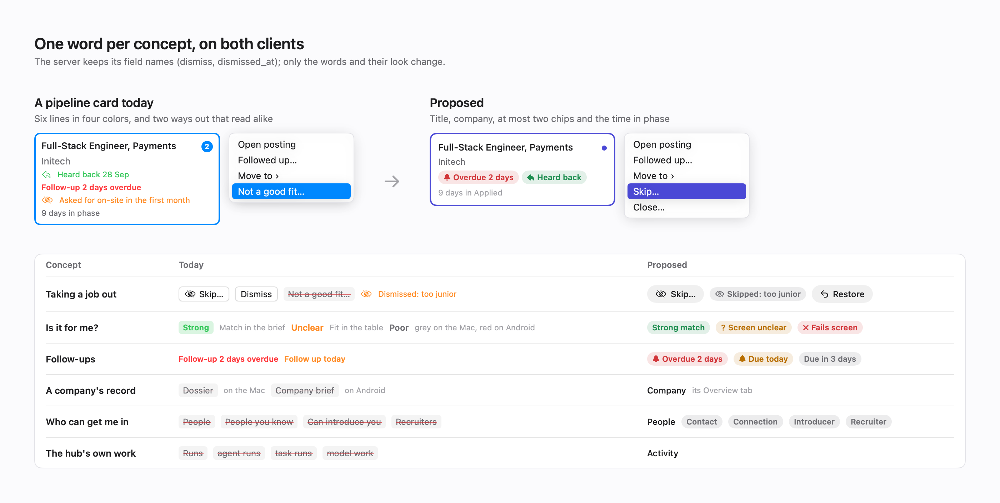
5. **People are scattered.** Agent-found contacts, LinkedIn connections, introducers (warm paths)
   and recruiters are one concept, "who can get me in", split over four places, and only
   recruiters have a page.
6. **Search configuration is in Settings.** Criteria, take-home pay and phases change what every
   page shows, yet they sit with the connection token. LinkedIn import is in Settings › Network,
   while its results appear in Profile, Recruiters, Suggestions and People you know.
7. **Sessions are squeezed.** A Claude session is a terminal inside a 360–720 pt inspector, behind
   a Details/Session switch, and the profile interview opens beside Profile in yet another way.
8. **The phone can't act on its own reminders.** It gets follow-up reminders but has no pipeline,
   so you can't record the follow-up where the notification lands.

## The design system

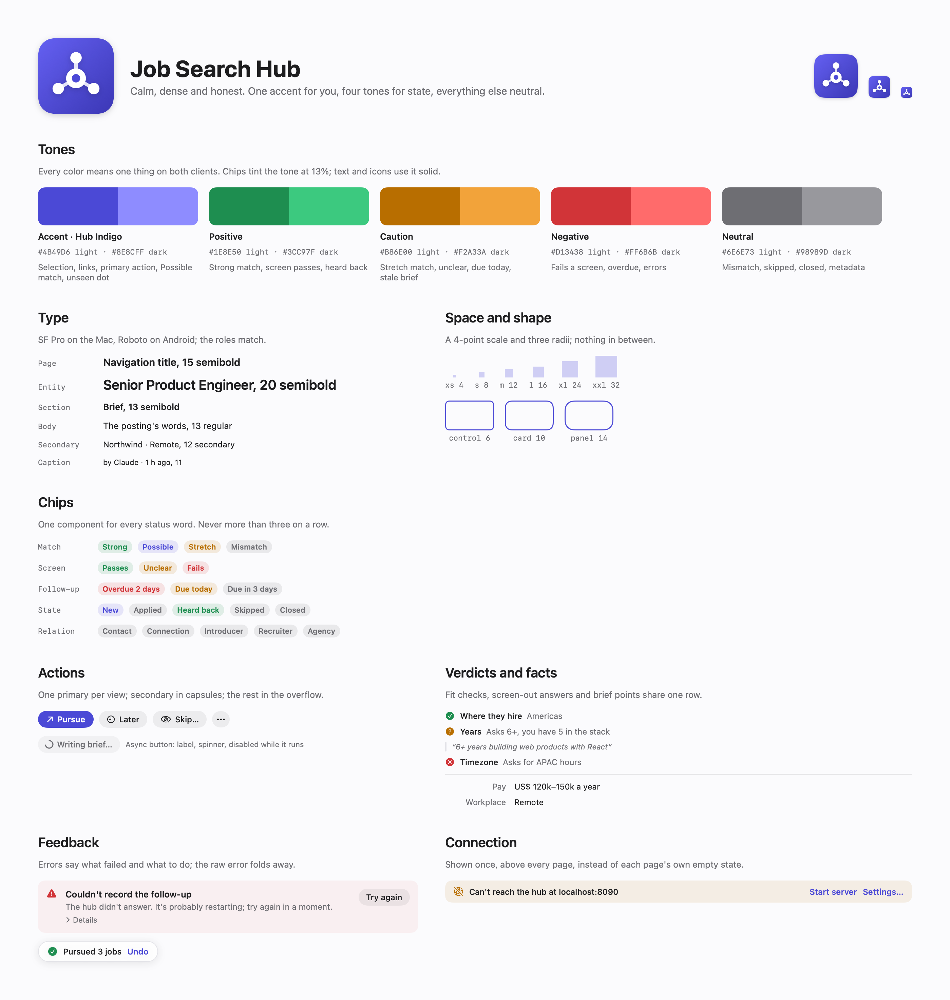

### Identity

- **Character:** calm, dense and honest. It's a working tool used every day, so the identity is
  in restraint: neutral surfaces, one accent, color only where it means something.
- **Accent, Hub Indigo:** `#4B49D6` light, `#8E8CFF` dark. It marks you and your actions:
  selection, links, the primary button, the unseen dot. Indigo is chosen because it isn't a status
  color, so it never reads as good or bad.
- **Icon:** a hub, you, joined to three nodes (a company, a job, a person) on an indigo squircle.
  The same mark on macOS (`.icns` through `iconutil`) and Android (adaptive icon).
  `macos/Scripts/make-icon.swift` draws it for both: `make-app.sh` runs it on every build, and its
  header says how to regenerate the Android layers.
- **Android builds its Material 3 scheme from Hub Indigo** as the seed, so both clients share an
  accent while Android still looks like Android. *Match wallpaper colors* in Settings switches to
  dynamic color for those who want it. See [Android](#android-material-3-expressive-and-one-ui).

### Tones

Every color means one thing. Chips use the tone at 13% behind solid text; icons use it solid.

| Tone | Light | Dark | Means |
|---|---|---|---|
| Accent | `#4B49D6` | `#8E8CFF` | You and your actions; a Possible match; unseen |
| Positive | `#1E8E50` | `#3CC97F` | Strong match, passes a screen, heard back |
| Caution | `#B86E00` | `#F2A33A` | Stretch match, unclear, due today, stale brief, waiting for you |
| Negative | `#D13438` | `#FF6B6B` | Fails a screen, overdue, errors |
| Neutral | `#6E6E73` | `#98989D` | Mismatch, skipped, closed, relations, metadata |

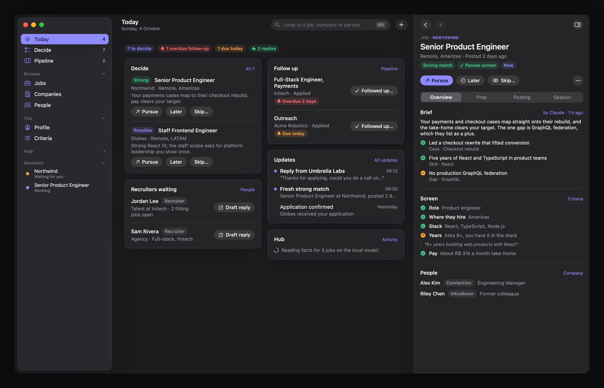

The mapping from states to tones lives in the shared core (`JobSearchHubCore`, `android/core`),
where it's unit tested, so the two clients can't drift:

| State | Tone |
|---|---|
| Match: Strong, Possible, Stretch, Mismatch | positive, accent, caution, neutral |
| Screen: Passes, Unclear, Fails | positive, caution, negative |
| Follow-up: overdue, due today, due later | negative, caution, neutral |
| Skipped, closed, dismissed card | neutral, with its icon |
| Session: working, waiting for you, idle | accent, caution, positive |

### Type

SF Pro on the Mac and Roboto on Android, with the same roles:

| Role | macOS | Android | Use |
|---|---|---|---|
| Page | navigation title | `headlineLarge`, `titleLarge` once collapsed | The page's name in the toolbar or app bar |
| Entity | 20 semibold (`.title2.weight(.semibold)`) | `headlineMedium` | A job's, company's or person's name in its inspector |
| Section | 13 semibold (`.headline`) | `titleSmall` | Brief, Screen, People |
| Body | 13 (`.body`) | `bodyMedium` | Text you read |
| Secondary | 12 secondary (`.callout`) | `bodySmall`, `onSurfaceVariant` | Company, location, reasons |
| Caption | 11 (`.caption`) | `labelSmall` | Who wrote it and when |
| Evidence | 11 italic in quotes, with a rule | `bodySmall` italic | Words quoted from a posting |

### Space and shape

- **Spacing:** `xs 4`, `s 8`, `m 12`, `l 16`, `xl 24`, `xxl 32`. Rows within a section use `s`,
  sections are `l` apart, and pages pad by `xl`.
- **Radii:** `control 6` (fields, small buttons), `card 10` (cards, wells), `panel 14` (sheets,
  floating panels). Chips and buttons are capsules. These are the Mac's; Android uses the Material 3
  shape scale instead (below).
- **Surfaces:** the window background, a **card** (background with a separator hairline) for a
  group on a page, and a **well** (`.quinary`) for quoted or generated text like a drafted reply.
  On macOS 26 the sidebar and toolbars keep the system's Liquid Glass; content stays opaque.

### Components

Each is built once per client, in `macos/Sources/JobSearchHub/DesignSystem/` and
`android/app/.../ui/design/`. The names and meanings are shared; on Android each one wraps a
Material 3 component (see [Android](#android-material-3-expressive-and-one-ui)). The last column
lists the ad hoc versions it replaces.

| Component | What it is | Replaces |
|---|---|---|
| `ToneChip` | A status word in a tone, with an optional symbol | `MatchLabel`, `FitLabel`, New and Agency pills, Later caption |
| `HubSection` | A section title with an optional trailing link, and its content | Four private `section()` helpers and the heading styles |
| `VerdictRow` | Symbol, name and reason, with optional quoted evidence | Fit checks, screen-out answers, `FitCheckCell`, brief points |
| `FactGrid` | Right-aligned labels and values | `factRow`, `textRow`, `row`, `LabeledContent` |
| `EntityHeader` | Eyebrow (kind and parent link), title, one fact line, up to three chips | Each detail view's own header |
| `ActionBar` | One primary, up to two secondary and an overflow menu | Rows of up to five equal buttons |
| `AsyncButton` | A button that shows its busy label and spinner and disables itself | Each hand-made "…ing" state |
| `HubErrorView` | What failed and what to do, a retry, the raw error under Details | `String(describing: error)` in red, orange, alerts |
| `Toast` | One transient confirmation at the window's bottom, with Undo where it can | The Jobs page's notice capsule |
| `ConnectionBanner` | One window-level banner when the hub can't be reached, with Start server and Settings | Ten "Not connected" pages |
| `PersonRow` | Name, relation chip, role, and the action that fits (draft reply, introduce) | Four people sections |

### Usability rules

- **One primary action per view.** It's the next step for the entity's state: *Pursue* for a job
  to decide, *Followed up…* for a due card, *Draft reply* for a waiting recruiter.
- **Toolbars hold view controls and one Add menu.** Bulk and rare actions (Generate missing CVs,
  Add by URL, Suggestions) move to the Add menu, the overflow, or ⌘K.
- **No Refresh buttons.** The event stream refreshes pages; ⌘R in the View menu stays for when it
  doesn't.
- **Color never stands alone.** Every chip has a word, every verdict a symbol, and each has an
  accessibility label.
- **Help goes in tooltips and footers**, not paragraphs above the content. The Suggestions sheet's
  three-line intro becomes a footer line.
- **Destructive and leaving actions confirm,** including unpairing a phone.
- **Keyboard first on the Mac:** ↑↓ to move, Return to open, P, L and S to decide, ⌘K to jump,
  ⌘N for the Add menu, ⌘[ and ⌘] for inspector history.

### Voice

Short, plain and in sentence case, as the app already is at its best. One verb per action on
both clients:

| Action | Word | Not |
|---|---|---|
| Take a job or card out as not for you | **Skip…** (with a reason) | Dismiss, Not a good fit |
| Bring it back | **Restore** | Undismiss |
| End an application with an outcome | **Close…** (with a reason) | |
| Put it on the pipeline | **Pursue** | Add to pipeline |
| Leave for another day | **Later** | |
| Ask an agent to correct a job | **Fix…** | |
| The list of skipped things | **Skipped** | Dismissed |

The server keeps its field and route names (`dismiss`, `dismissed_at`); only the words change.

## Information architecture

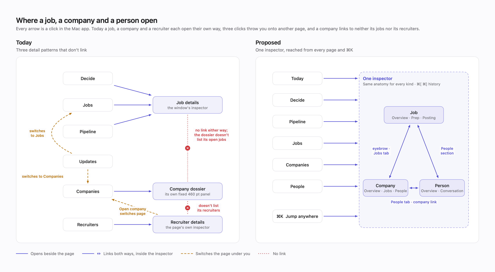

### Navigation

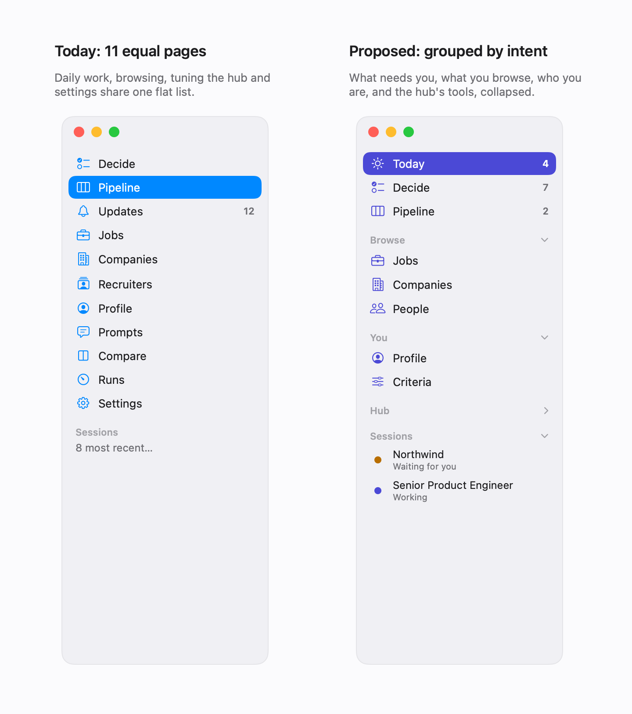

The sidebar groups pages by intent:

```
Today            what needs you now                  badge: unseen updates
Decide           the queue                           badge: jobs to decide
Pipeline         applications by phase               badge: follow-ups due
Browse
  Jobs
  Companies
  People         contacts, connections, introducers and recruiters (replaces Recruiters)
You
  Profile        tabs: Profile · Knowledge base · Gaps · LinkedIn · Answers
  Criteria       job criteria, take-home pay, pipeline phases (from Settings)
Hub              collapsed by default
  Activity       local models and runs (was Runs)
  Prompts
  Model lab      (was Compare)
Sessions         running sessions, then recent ones
```

- **Updates folds into Today**, which shows the unseen ones and links to the full history.
- **Settings becomes the standard Settings window (⌘,)** with tabs: Connection, Server, Accounts
  (Google, LinkedIn import, session folder), Phones, Models.
- **The app opens on Today**, on both clients.

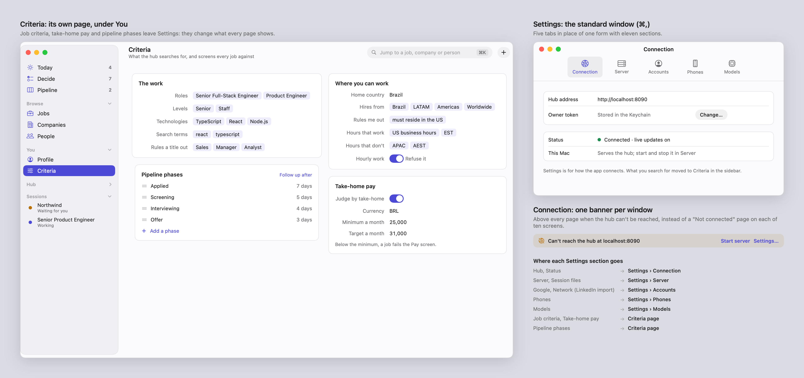

### Today

Today answers "what should I do now?" with a card for each source, each item actionable in place
and opened in the inspector. Only the cards that have something show:

- **Decide:** the top three by match, with Pursue, Later and Skip inline.
- **Follow up:** cards overdue or due today, with *Followed up…*.
- **Updates:** unseen replies, confirmations and fresh strong matches.
- **Recruiters waiting:** unanswered conversations whose company has fitting jobs, with *Draft
  reply*.
- **Hub:** what the agents and local models are doing, only while they're doing it.

A line of chips at the top sums it up: "7 to decide · 1 overdue · 1 due today · 2 replies". Today
needs no new endpoint; it reads the decision queue, the pipeline, updates and recruiters.

### One inspector for every entity

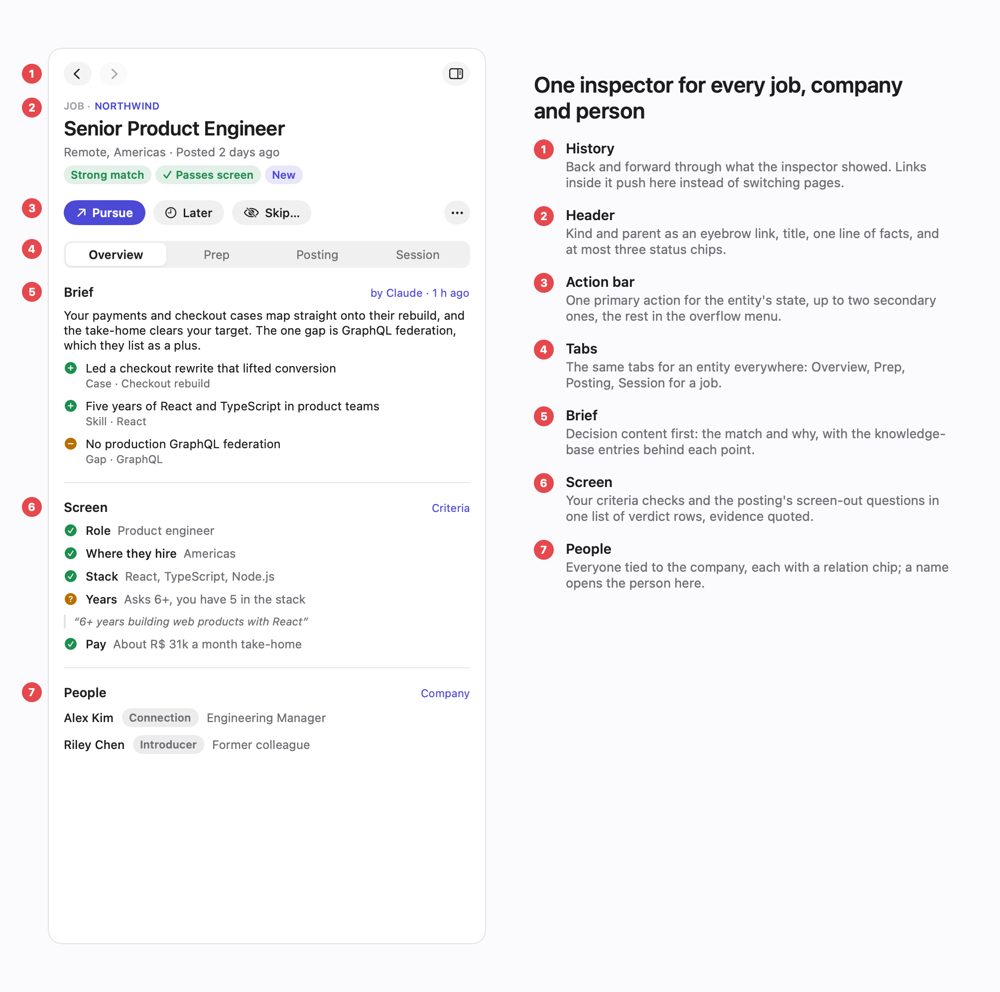

Jobs, companies and people all open in the window's inspector, from any page, with the same
anatomy:

1. **History:** back and forward through what the inspector showed (⌘[ and ⌘]). A link inside the
   inspector opens there and pushes history; it never switches the page under you.
2. **Header:** the eyebrow names the kind and links to the parent (JOB · NORTHWIND), then the
   title, one line of facts, and up to three chips.
3. **Action bar:** one primary action, up to two secondary ones, the rest in the overflow.
4. **Tabs**, the same for a kind everywhere:

   | Kind | Tabs |
   |---|---|
   | Job | **Overview** (brief, screen, people) · **Prep** (CV, interview pack, answers; after Pursue) · **Posting** (board facts, read facts, the posting) · **Session** |
   | Company | **Overview** (summary, boards, applications, latest mail) · **Jobs** (its open jobs, new to the Mac) · **People** · **Session** |
   | Person | **Overview** (relation, company, what they can do for you) · **Conversation** (LinkedIn messages, drafted reply) |

5. **Screen** merges the fit checks with the screen-out answers: both ask "does this rule me
   out?", and both become verdict rows.
6. **Sessions** get *Open in window*, so a long session can leave the inspector's width.

The Companies page drops its fixed panel and the Recruiters page its own inspector. Clicking an
update opens its job or company over the current page.

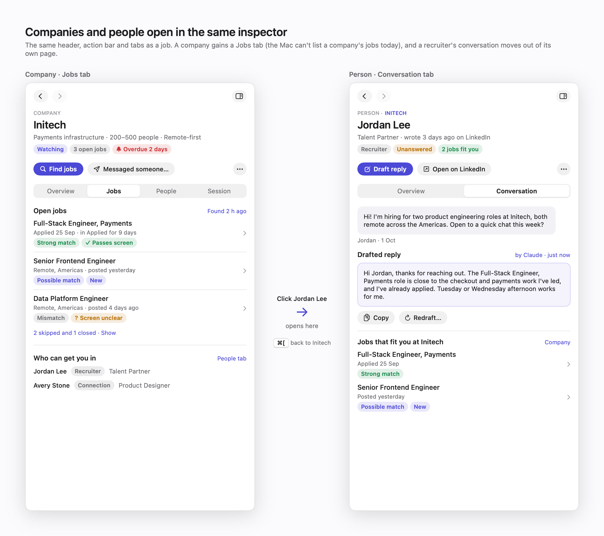

### People

One page and one model for everyone who can get you in:

| Relation | Source today | Shown today |
|---|---|---|
| Contact | Agent-found people in a dossier | Company › People |
| Connection | LinkedIn connections | People you know |
| Introducer | Warm paths | Can introduce you |
| Recruiter | LinkedIn conversations | Recruiters page |

The People page is a table with relation, company, role, last contact and whether you answered,
plus filters for relation, *Hiring now* and *Unanswered*. A company's People tab is the same list
filtered to it. This needs a server endpoint, `GET /v1/people`, that lists all four with their
relation; `GET /v1/connections` and `GET /v1/recruiters` cover only two.

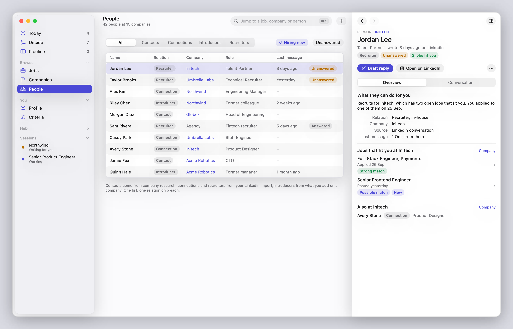

### Jump anywhere (⌘K)

A palette that searches jobs, companies, people and pages, and runs actions such as Add company,
Add job by URL, Generate missing CVs and Pause local models. It's how rare actions leave the
toolbars, and it gives "better access to information" in one place.

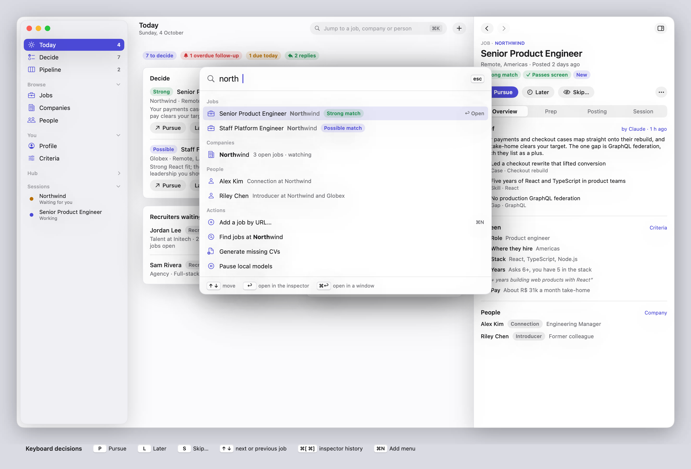

### Android: Material 3 Expressive and One UI

The Android client shares the Mac's information architecture, words and tone meanings, but not its
look. It follows [Material 3 Expressive](https://m3.material.io/) and Samsung's
[One UI](https://developer.samsung.com/one-ui) guidance, so it feels like the other apps on the
phone. The first draft of these mockups borrowed iOS habits: grouped tables with ALL-CAPS headers,
chevron rows, a horizontal `…` menu, iOS switches and alerts, capsule chips, SF type. Every one of
them is replaced below.

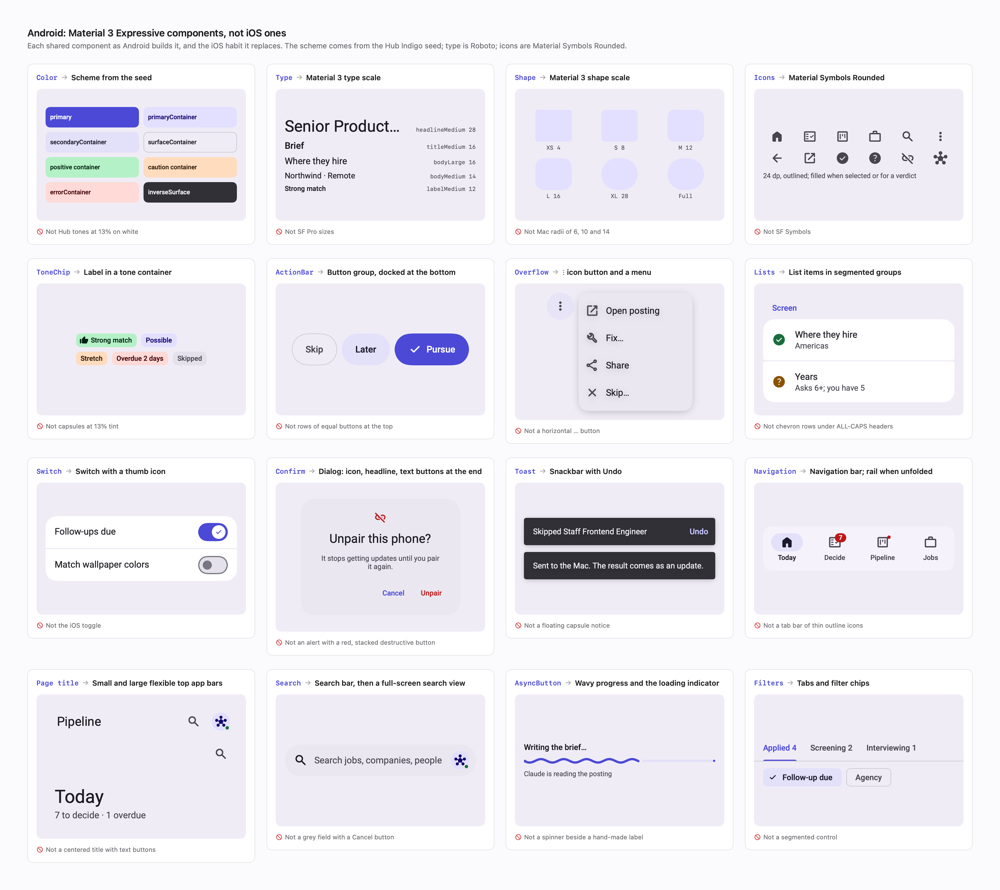

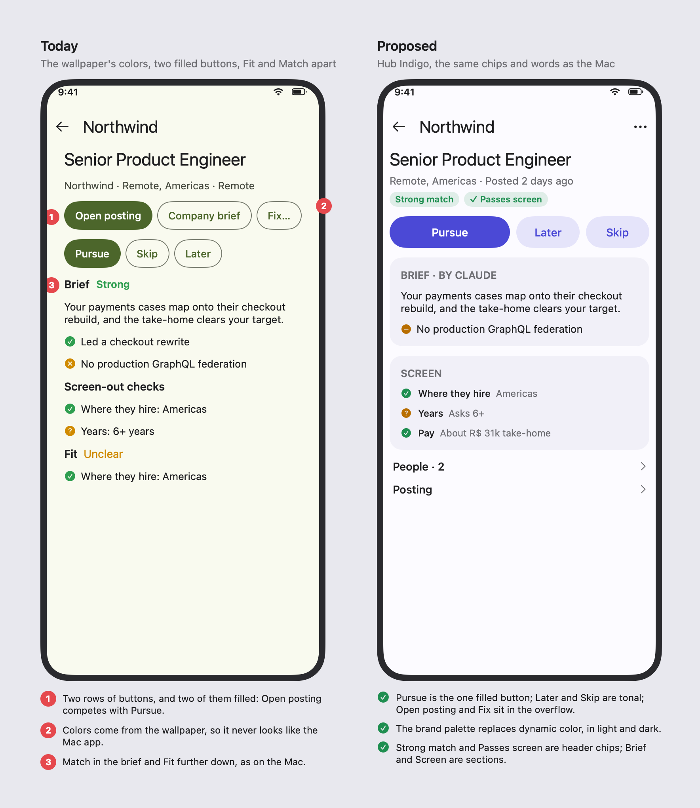

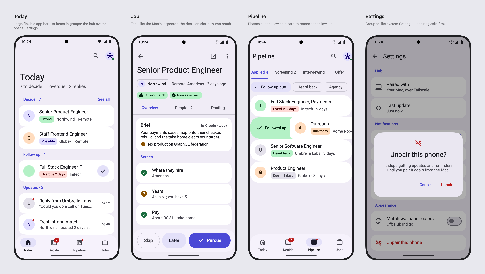

**Platform rules**

| Area | Rule | Not |
|---|---|---|
| Color | A Material 3 scheme generated from the Hub Indigo seed (the fidelity variant keeps `#4B49D6` as `primary`), light and dark. *Settings › Appearance › Match wallpaper colors* turns on dynamic color. The four tones are Material custom colors harmonized to the scheme, each with a container role, so they keep their meaning under either | Mac hex values at 13% on white |
| Type | The Material 3 type scale in Roboto (the roles in [Type](#type)), sized in `sp` so it follows the font size setting | SF Pro sizes |
| Shape | The Material 3 shape scale: 4 (snackbar, field), 8 (chips, labels), 12 (menus), 16 to 20 (cards, list groups), 28 (dialogs, sheets), full (buttons, FAB, search bar) | The Mac's 6, 10 and 14 |
| Icons | Material Symbols Rounded, 24 dp: outlined, filled when selected or for a verdict | SF Symbols |
| Navigation | A navigation bar with Today, Decide, Pipeline and Jobs (a pill indicator, badges for jobs to decide and follow-ups due). `NavigationSuiteScaffold` turns it into a rail on wide screens | A tab bar of thin icons |
| Top app bars | Large flexible on top-level pages (title plus a summary subtitle, collapsing on scroll), medium flexible on a job or company, small on Settings. Actions at the end, then the hub avatar, which opens Settings and the connection | Centered titles, text buttons in the bar |
| Overflow | `⋮` icon button and a Material menu with leading icons | A horizontal `…` |
| Back | System back and the predictive back gesture (`enableOnBackInvokedCallback`); a back arrow only on screens below the top level | Swipe-only back, close buttons |
| Lists | List items (leading monogram or icon, headline, supporting text, a status label) in segmented groups: large outer corners, small inner ones, 2 dp apart, as in system Settings. Group headings in `primary`, sentence case | Chevron rows, ALL-CAPS headers |
| Status | `ToneChip` is a label in the tone's container with 8 dp corners | Capsules at 13% tint |
| Actions | `ActionBar` is a medium button group docked at the bottom: one filled, one tonal, one outlined. The rest in the `⋮` menu | A row of equal buttons at the top |
| Filters | Primary tabs for phases and sections; filter chips for filters | Segmented controls |
| Feedback | `Toast` is a snackbar, with Undo where it can. `AsyncButton` uses the wavy progress or loading indicator. Pull to refresh only where the event stream can't reach | A floating capsule notice |
| Confirmation | A basic dialog: hero icon, headline, text buttons at the end (the destructive one in `error`) | An alert with stacked buttons |
| Forms and choices | Modal bottom sheets with a drag handle, outlined text fields, the Material date picker | Popovers, iOS pickers |
| Edge to edge | Content draws under the status and gesture bars, with insets | Letterboxed bars |
| Accessibility | 48 dp touch targets, TalkBack labels on every icon button and label, text that scales to 200% | |

**Samsung One UI** asks for the same things in its own words, and the rules above meet them:
content to read in the top half and controls to touch in the bottom half (the large app bar on top,
the docked button group and navigation bar at the bottom), rounded grouped containers, and layouts
that adapt to foldables, pop-up view and split screen.

**Screens**

- **Bottom bar:** Today, Decide, Pipeline, Jobs. Updates folds into Today, as on the Mac. The app
  opens on Today.
- **Today:** a large app bar with "7 to decide · 1 overdue · 2 replies", then groups for Decide,
  Follow up and Updates. A follow-up is done with the tonal check button.
- **Job:** a medium app bar with Open posting and `⋮` (Fix…, Share, Skip…). The company is an
  assist chip that opens it. Overview, People and Posting are tabs, the same split as the Mac's
  inspector. Skip, Later and Pursue are docked at the bottom.
- **Pipeline:** phases as scrollable tabs, filter chips, and cards as list items. Swipe a card to
  record the follow-up, or use its `⋮` menu for *Followed up…* and *Move to*. Both open a bottom
  sheet with the next date.
- **Settings**, from the hub avatar: the paired hub, notifications, appearance, and *Unpair this
  phone* behind a dialog. "Research a company" moves to the Today overflow as *Ask the Mac…*.

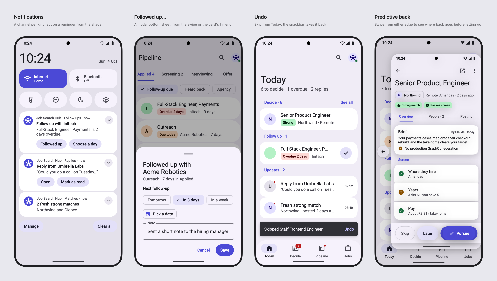

**System surfaces**

- **Notifications:** one channel per kind (Follow-ups, Replies, Matches, Hub), so each can be
  muted on its own, with actions: *Followed up* and *Snooze a day* on a reminder, *Open* and *Mark
  as read* on a reply. Several of a kind group under a summary.
- **Undo:** Skip and Later from a list show a snackbar with Undo, instead of asking first.
- **Predictive back:** swiping from the edge shows where back goes before you let go.

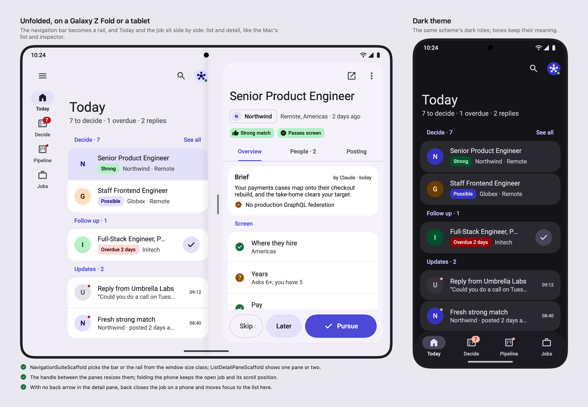

**Large screens and dark theme**

- On an unfolded Galaxy Z Fold or a tablet, `NavigationSuiteScaffold` shows a rail, and
  `ListDetailPaneScaffold` puts the list beside the open job or company, like the Mac's list and
  inspector. Folding keeps the open item and its scroll position.
- Dark theme uses the same scheme's dark roles. The tones keep their meaning in their dark
  containers.

## Rollout

Each step ships on its own and keeps the app working. The order lowers risk: the shared pieces
land first, then the structure, then the new pages. Each row is a sub-issue of TP-440, in Backlog
until the proposal is approved. TP-456 and TP-458 were filed before the Android section above was
rewritten; where their descriptions differ from it (dynamic color, the components), this document
wins.

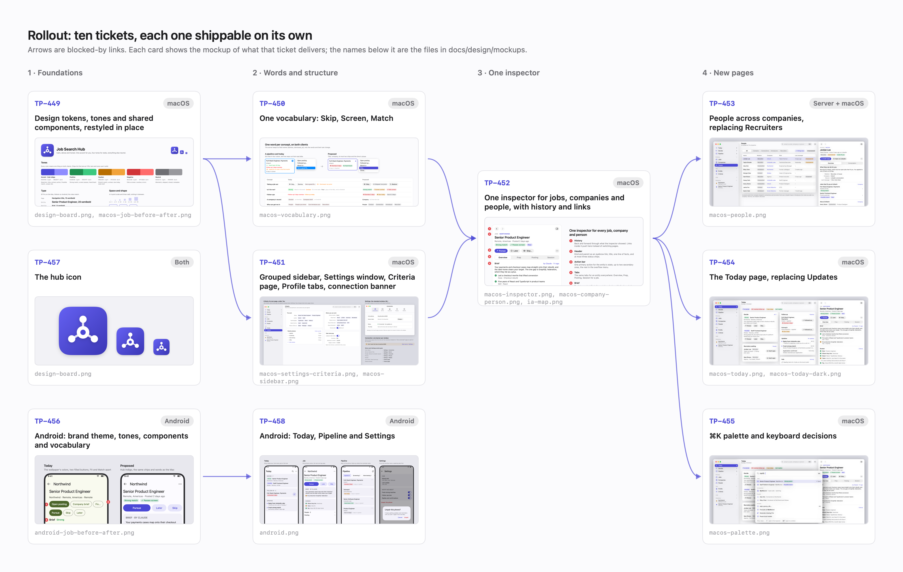

| # | Ticket | Blocked by | Mockups |
|---|---|---|---|
| 1 | TP-449 macOS: design tokens, tones and shared components, restyled in place | none | design board, job before/after |
| 2 | TP-450 macOS: one vocabulary (Skip, Screen, Match) and Screen merges fit and screen-out | TP-449 | vocabulary |
| 3 | TP-451 macOS: grouped sidebar, Settings window, Criteria page, Profile tabs, connection banner | TP-449 | sidebar, settings and criteria, IA map |
| 4 | TP-452 macOS: one inspector for jobs, companies and recruiters, with history and cross-links | TP-450, TP-451 | inspector, company and person, IA map |
| 5 | TP-453 Server and macOS: People across companies, replacing Recruiters | TP-452 | people |
| 6 | TP-454 macOS: the Today page, replacing Updates in the sidebar | TP-452 | today, today dark |
| 7 | TP-455 macOS: ⌘K palette and keyboard decisions | TP-452 | palette |
| 8 | TP-456 Android: Material 3 theme from Hub Indigo, tones, components and vocabulary | none | Android components, Android job before/after |
| 9 | TP-458 Android: Today, Pipeline and Settings, with the *Followed up…* sheet, Undo and predictive back | TP-456 | Android, Android system |
| 10 | TP-462 Android: notification channels and actions | TP-458 | Android system |
| 11 | TP-463 Android: adaptive layout for foldables and tablets | TP-458 | Android foldable |
| 12 | TP-457 Both: the hub icon | none | design board |

## Open questions for review

- **Dynamic color on Android.** The proposal defaults to the Hub Indigo scheme and offers *Match
  wallpaper colors* as a setting. The alternative is dynamic color by default, with Hub Indigo for
  phones before Android 12. Either way the tones stay harmonized custom colors.
- **Indigo as the accent.** The alternative is to keep the system accent and brand only the icon.
  Indigo gives both clients one look, and nothing else in the UI uses it.
- **Renaming Fit to Screen.** It's the change most likely to feel unfamiliar at first. It's
  proposed because Fit and Match side by side are the biggest source of confusion.
- **Updates as a page.** This proposal folds it into Today, with the full history one click away.
  Keeping it as a page costs a sidebar row and keeps the overlap.
