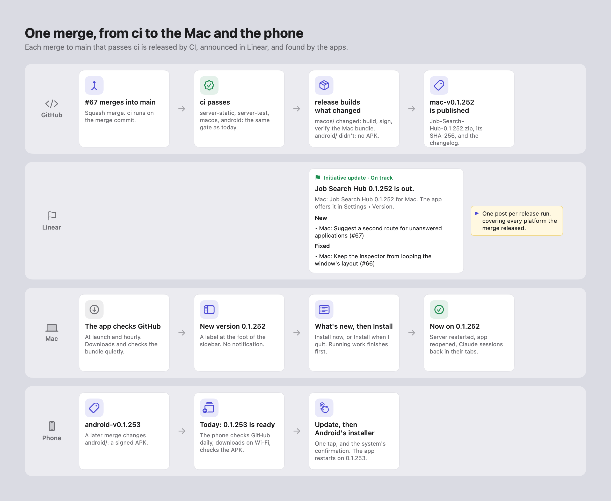
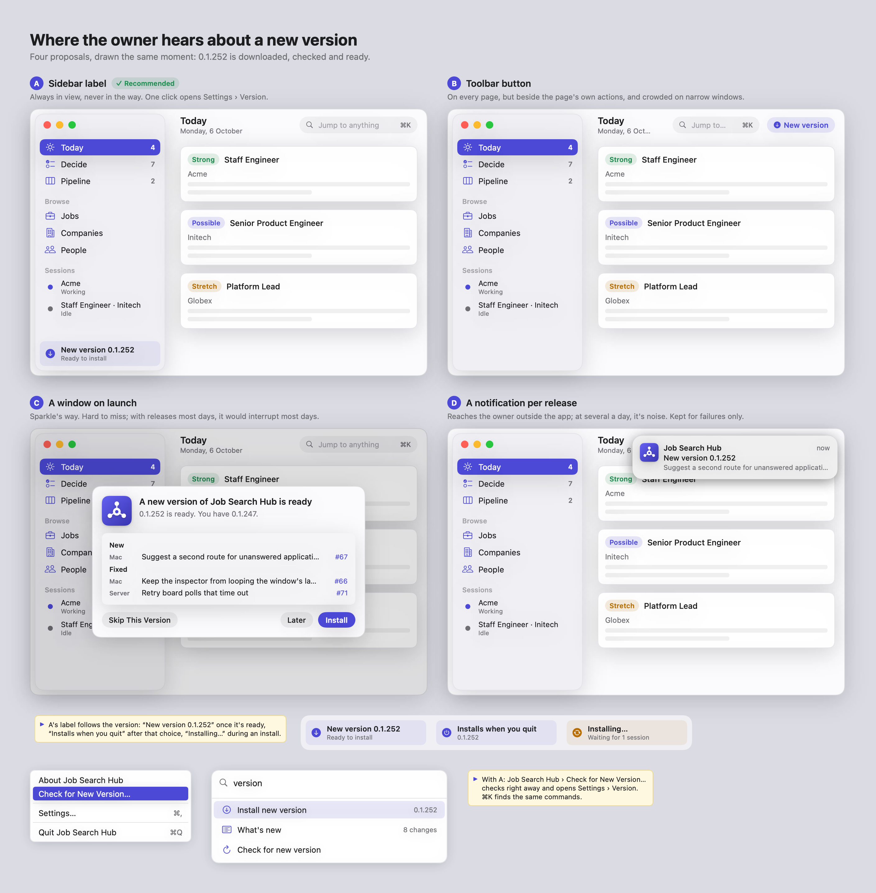
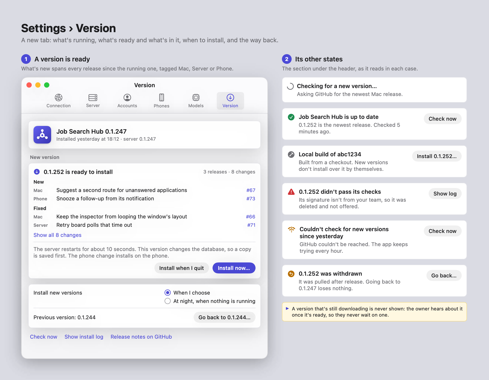
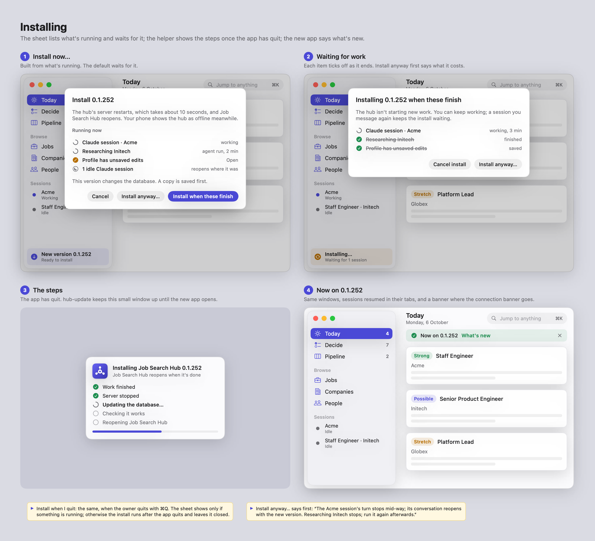
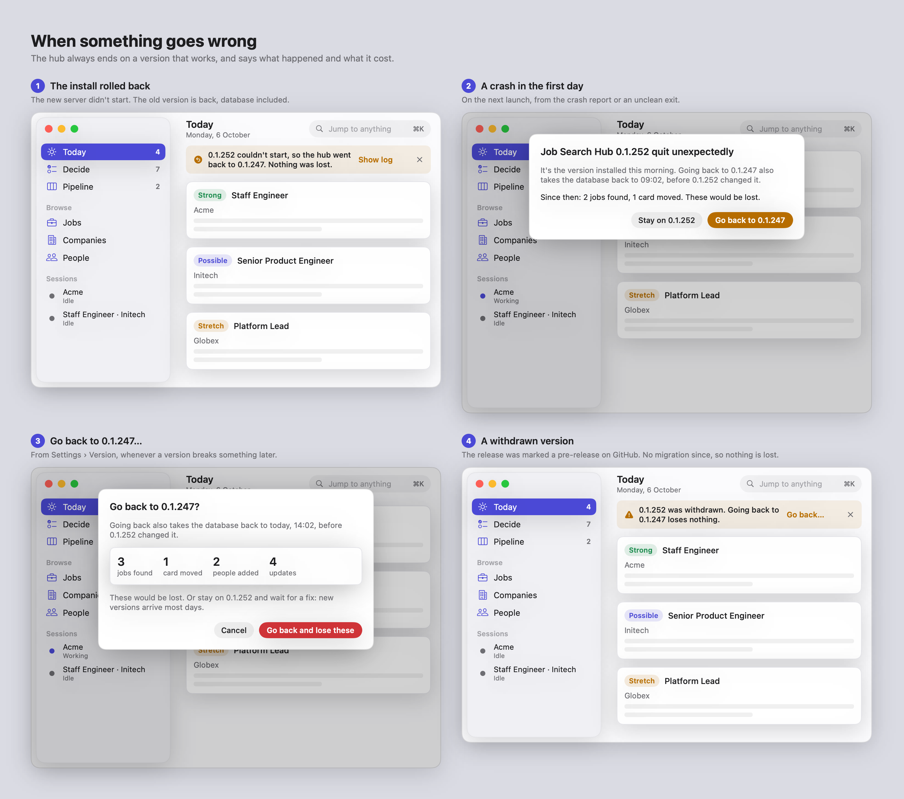
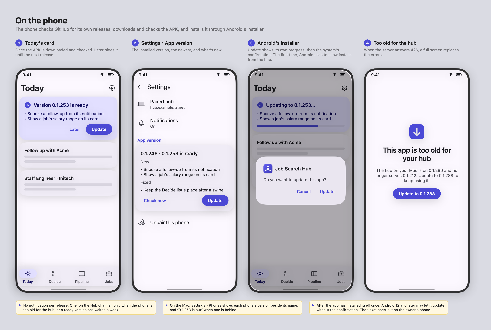

# How the hub updates itself

Research and proposals for getting each merge to `main` onto the owner's Mac and phone, without
anyone pulling the repository and running scripts. It starts from what the owner wants to do, goes
through the screens on both apps, and ends with the machinery and the tickets. Nothing in the hub
changes with this document.

A first version of this design (in this pull request's history) had the Mac build each version
itself from a clone of the repository. That's replaced here: **every merge to `main` is released
from CI**, as the Android app already is, and both apps find and install those releases.

The mockups in `mockups/` are drawn offscreen by SwiftUI from `mockups/updates.swift`, with made-up
companies and changes:

```bash
swift docs/design/mockups/updates.swift docs/design/mockups
```

| Mockup | What it shows |
|---|---|
| [`updates-journey.png`](mockups/updates-journey.png) | One merge, from `ci` to the owner's Mac and phone |
| [`updates-macos-hearing.png`](mockups/updates-macos-hearing.png) | Four ways the Mac app could say a version is ready, side by side |
| [`updates-macos-version.png`](mockups/updates-macos-version.png) | Settings › Version in its states |
| [`updates-macos-install.png`](mockups/updates-macos-install.png) | The install sheet, waiting for work, the steps, and the *Now on* banner |
| [`updates-macos-recovery.png`](mockups/updates-macos-recovery.png) | A failed install, a crash on a new version, going back, a withdrawn version |
| [`updates-android.png`](mockups/updates-android.png) | The phone: Today's card, Settings, the install, a phone too old for the hub |

## Summary

What this proposes, each choice argued below:

1. **CI releases every merge.** After `ci` passes on `main`, `release.yml` builds, signs and
   publishes the Mac app (`mac-v0.1.<N>`) when `server/` or `macos/` changed, and the Android app
   (`android-v0.1.<N>`) when `android/` changed, both numbered by the same commit count.
2. **One Linear initiative update per release**, with the version, links and the changelog for each
   platform the merge released.
3. **The Mac app is one bundle that holds everything**: the app, `hub-server`, `hub-cvprint`, the
   `hub` command, the installer, and later the bundled Postgres. One version, one signature, one
   download, one swap, one thing to go back to.
4. **Each app finds its own releases** on GitHub, so a broken server can't stop the Mac from
   getting the fix, and the phone hears about a new APK without the Mac.
5. **The Mac app installs its own updates** with a small helper, `hub-update`, that takes over once
   the app quits: it stops the server, swaps the bundle, starts the new server, checks it, reopens
   the app, and puts everything back if anything fails. Sparkle was considered and isn't
   recommended: most of the work is the server, which it doesn't know about.
6. **The owner chooses when.** By default the app asks. A quiet label in the sidebar says a version
   is ready; *Install now* and *Install when I quit* are one click away. Night installs are an
   opt-in, once the crash check below exists.
7. **Nothing gets cut off without a word.** The install sheet lists what's running and waits for it.
   Claude sessions reopen where they were.
8. **Going back is always possible, and honest.** A failed start rolls back by itself. A crash in
   the new version's first day offers to go back. Going back says which writes it would lose.
9. **The phone installs in the app.** It downloads the APK, checks it, and hands it to Android's
   installer: one tap, no browser.

## Words

In the hub, an **update** is already an item in the Updates feed: a follow-up that fell due, a fresh
match, a reply. To keep the two apart, the apps call a release a **new version**, and say
"Install 0.1.252", "Settings › Version", "What's new". A version only appears in the Updates feed
when something went wrong with one (see [Failures](#failures)).

## Today

- **The Mac**: after each merge, the supervisor session pulls `main` in `~/repos/job-search-hub`,
  runs `server/scripts/install-native-server.sh` (builds `hub-server` and `hub-cvprint` into
  `~/Library/Application Support/JobSearchHub/bin/`, writes `run-hub-server`, and boots the
  `com.tonypine.jobsearchhub.server` LaunchAgent out and back in), then `macos/Scripts/make-app.sh`,
  and quits and reopens the app from `macos/build/JobSearchHub.app`. Every version is `0.1.0`.
- **The phone**: each merge that changes `android/` becomes a signed APK on GitHub Releases,
  `android-v0.1.<N>`, and a Linear project update (`release.yml`,
  `docs/decisions/0001-android-release-distribution.md`). The owner opens the release page on the
  phone, downloads the APK and installs it. The app doesn't know a new one exists.

What the code does at a restart, which the design builds on:

- **The server's background work is driven by the database.** Every poller and writer runs as a
  pass over rows that still need work, so a pass a restart cuts short is picked up by the next one.
  Comparisons resume (`comparisons.Runner.RunUnfinished`), agent runs whose process died are closed
  (`abandonedruns`), Gmail catches up from its history ID, and the Mac app's event stream resumes
  from the last event it heard (`HubEventStream`).
- **A restart loses the call in flight**: a local model call (`modelqueue` lives in memory), or a
  `claude -p` run for a full brief or a CV draft (`claudeprint`, killed with the server). The next
  pass runs it again, and a `claude -p` run uses the Claude plan again. The server stops 5 seconds
  after `SIGTERM` (`shutdownTimeout`), and nothing waits for background work.
- **MCP sessions live in the server's memory** (`mcptools.NewHandler`, stateful streamable HTTP),
  so after a restart an open Claude session holds a session ID the server doesn't know.
- **Embedded Claude sessions are the Mac app's child processes** (`ClaudeSessionHost`). Quitting the
  app ends them; the conversation survives in Claude Code's transcript and *Resume session* picks
  it up, but a turn in progress is cut off. The app already knows what each session is doing:
  `working`, `blocked` (a permission prompt or a question) or `idle`.
- **Migrations** are goose files embedded in `hub-server`, applied at start (`store.Migrate`). Every
  file has a `Down` section, untested, and some lose data.
- **Signing**: `make-app.sh` signs the app and its bundled `hub` with the first `Apple Development:`
  identity in the keychain, with the hardened runtime. That keeps the app's designated requirement
  stable, so its Keychain item (the owner token) survives rebuilds. `hub-server` and `hub-cvprint`
  carry only the linker's ad hoc signature.
- **The owned database** (`docs/design/owned-database.md`, proposed) has `hub-server` run a bundled
  Postgres from `../engines` beside its own binary, dump the database before it applies pending
  migrations, restore with `hub-server database restore`, and refuse a cluster newer than its
  engines. It leaves to this design how the engine reaches the Mac.

## What the owner wants

The user stories this design answers, and where each one lands. "The owner" is the one person who
runs the hub, on one Mac and one phone.

| # | As the owner, I want… | So that… | Answered by |
|---|---|---|---|
| 1 | to know a new version is ready without being interrupted | merges several times a day don't become noise | the sidebar label; no notification per version ([Proposal 2](#proposal-2-where-the-owner-hears-about-it)) |
| 2 | to see what changed, in words about what I see | I can decide whether it's worth a restart now | *What's new* in Settings › Version, grouped and tagged by app |
| 3 | to install with one click, when it suits me | an install never surprises me mid-task | *Install now*, *Install when I quit* ([Proposal 3](#proposal-3-when-a-version-installs)) |
| 4 | the hub to finish what it's doing first | no Claude turn, draft or research run is lost | the install sheet's *Install when these finish* |
| 5 | my Claude sessions back after the restart | I pick up where I was | sessions reopen in their tabs, resumed |
| 6 | to know it worked, and what's new | I trust the update | the *Now on 0.1.252* banner |
| 7 | a version that doesn't start to undo itself | I never repair a half-installed hub | automatic rollback |
| 8 | to go back when something breaks later, knowing what I'd lose | a bad version costs minutes, not data | *Go back to 0.1.247…*, and the crash prompt |
| 9 | the phone to tell me about its new version and install it in a tap | the phone doesn't fall behind | Today's card, Android's installer ([Proposal 4](#proposal-4-how-the-phone-updates)) |
| 10 | a phone that's behind to keep working | I don't have to update both at once | the API compatibility rule |
| 11 | each release posted in Linear with its changelog | I can follow what shipped without opening the app | the initiative update |
| 12 | optionally, updates to install by themselves when I'm not using the hub | the hub stays current without me | *At night* ([Proposal 3](#proposal-3-when-a-version-installs)), off by default |
| 13 | to pull a bad release for everyone | nobody installs it while a fix is coming | withdrawn releases |
| 14 | as a developer, to run a local build without the updater fighting me | development keeps working | local builds |

What "better than drain, swap, relaunch and resume" means here, beyond those four steps: the owner
sees what's in a version before installing, sees what an install would interrupt and what that
costs, can install on quit, gets their sessions back, is offered a way back after a crash, is told
about a release that was pulled, and gets the same care on the phone.

## The journey



1. A pull request merges into `main`. `ci` runs on the merge commit.
2. `ci` passes, and `release` starts. It sees `macos/` changed, so it builds, signs and checks the
   Mac bundle, and publishes **Job Search Hub 0.1.252 for Mac**. `android/` didn't change, so no APK.
3. It posts one **Linear initiative update**: "0.1.252 is out", with the changelog.
4. Within the hour, the Mac app sees the release, downloads and checks it in the background, and
   shows **New version 0.1.252** at the foot of the sidebar.
5. The owner clicks it, reads *What's new*, and picks **Install now** or **Install when I quit**.
6. The app waits for running work, quits, and the helper swaps the bundle and restarts the server.
   The app reopens with its sessions, and says **Now on 0.1.252**.
7. On a merge that changes `android/`, the phone shows **0.1.253 is ready** on Today. A tap, and
   Android's installer updates it.

## Releases from CI

### What a merge releases

`scripts/release/plan.sh` decides it per platform, by diffing against that platform's previous
release tag, as it does today for Android:

| The merge changed | Mac release | Android release |
|---|---|---|
| `server/` or `macos/` | `mac-v0.1.<N>` | — |
| `android/` | — | `android-v0.1.<N>` |
| both | both, with the same `N` | |
| only docs, CI, scripts | nothing | nothing |

The server ships inside the Mac bundle, so a server-only merge releases the Mac app. With merges
landing several times a day, the Mac releases about as often.

### Versions

**One number for both platforms**: `0.1.<N>`, where `N` is `git rev-list --count` of the released
commit on `main`, as Android's `versionCode` already is. `main` takes squash merges and refuses
force pushes, so `N` only grows. A Mac release and an APK from the same merge share the number,
and a lower number is always an older commit. The `0.1` stays in `android/app/build.gradle.kts`'s
`versionMajorMinor`, and `plan.sh` uses it for both.

The release job stamps it into the app's `CFBundleShortVersionString` and `CFBundleVersion`, and
into `hub-server`, `hub` and `hub-update` (`-ldflags -X`) and `hub-cvprint`. A new
`GET /v1/version` reports the server's version, commit and newest migration.

### The Mac release job

A new job in `release.yml`, beside the Android one, on the same `macos-26` runner `ci`'s `macos` job
uses. GitHub's standard runners cost nothing for a public repository, so a macOS build per merge
costs only its ten-odd minutes.

1. **Check the signing secrets** first, and name the missing ones, as the Android job does.
2. **Build** with `make-app.sh`, which grows into the one script that assembles the whole bundle
   (see [One bundle per version](#one-bundle-per-version)): the app, `hub-server` and `hub` for
   `darwin/arm64`, `hub-cvprint`, `hub-update`, and, once the owned database ships, the Postgres
   engine pinned by checksum from its own release.
3. **Sign** every executable and library in the bundle, inside out, then the bundle, with the
   owner's identity from a temporary keychain that the job deletes at the end (see
   [Signing](#signing)).
4. **Verify** with a new `scripts/release/verify-app.sh`, which refuses a bundle that:
   - fails `codesign --verify --strict --deep`;
   - is signed by any team other than `MAC_SIGNING_TEAM_ID`, anywhere inside;
   - lacks the hardened runtime;
   - carries another version than planned, in `Info.plist` or in `hub-server --version`;
   - links a library outside the system and the bundle (`otool -L`), such as Homebrew's.
5. **Package** with `ditto -c -k --keepParent` as `Job-Search-Hub-0.1.<N>.zip`, and write
   `Job-Search-Hub-0.1.<N>.zip.sha256`.
6. **Write the changelog** (below) and **publish** the GitHub Release `mac-v0.1.<N>`, titled
   "Job Search Hub 0.1.<N> for Mac", with the zip and its checksum, at the built commit.

### Signing

**The owner's personal Apple Development certificate, from repository secrets**, the way the
Android release key already is:

| Secret | Value |
|---|---|
| `MAC_SIGNING_CERTIFICATE_BASE64` | the certificate and its private key, exported from Keychain Access as a `.p12`, base64 |
| `MAC_SIGNING_CERTIFICATE_PASSWORD` | the `.p12`'s password |
| `MAC_SIGNING_TEAM_ID` | the personal team's ID, which the job and the app both check |

- **Never the work identity.** The job signs with the identity whose team is `MAC_SIGNING_TEAM_ID`
  and nothing else. `make-app.sh` stops picking "the first Apple Development identity" and takes the
  team ID too, so a local build can't pick the work certificate by accident either.
- **The Keychain keeps trusting the app.** Its designated requirement names the certificate's
  common name and Apple's development anchor, so a release signed in CI and a local build signed on
  the Mac with the same certificate read the same Keychain item. The app also refuses to install a
  version whose designated requirement differs from its own.
- **No notarization.** Apple doesn't notarize with a development certificate. That doesn't matter
  for updates: the app downloads them with `URLSession`, which doesn't quarantine files, so
  Gatekeeper doesn't stop them. It matters only for the very first install from a browser, which
  asks the owner to allow it once in System Settings › Privacy & Security. The first install is
  normally the move from today's build (see [Moving to it](#moving-to-it)), which skips that too.
- **The certificate lasts a year.** The release job warns in its summary 30 days before it expires,
  and fails, by name, once it has. A renewed certificate keeps the common name and the team, so
  the designated requirement and the Keychain's trust stay the same. Renewal is a human action:
  export the new `.p12` and replace the two certificate secrets.
- **Every piece is signed**, `hub-server`, `hub-cvprint` and the Postgres engine's binaries and
  libraries included. With the hardened runtime, a process only loads libraries signed by its own
  team, so an engine signed by someone else wouldn't start.

**Revisit** if a paid Developer ID becomes available: notarized releases would install from a
browser without the System Settings step, and could run on a second Mac.

### The changelog

`scripts/release/changelog.sh` keeps its sections, and gains a tag per line for the part of the hub
the commit touched, and the pull request:

```markdown
## New

- Mac: Suggest a second route for applications unanswered past their follow-up (#67)

## Fixed

- Mac: Keep the inspector from looping the window's constraint updates (#66)
- Server: Retry board polls that time out (#71)

## Other changes

- chore: pin staticcheck in CI (#72)
```

- **Tags** come from the paths: `macos/` is **Mac**, `server/` is **Server**, `android/` is
  **Phone**; a commit touching two gets both ("Mac, Server").
- **The Mac release lists `server/` and `macos/` commits; the Android release lists `android/`
  ones**, as now.
- **The apps read this format** to show *What's new*, so it's fixed, and `changelog_test.sh` pins
  it. A revert reads "Took out: …" under **Fixed**.

### The Linear initiative update

The release workflow's last job posts **one initiative update per run**, on the initiative the
Job Search Hub project belongs to, covering every platform that run released. It replaces today's
project update for Android, so a merge that changes both apps makes one post, not two:

```markdown
**Job Search Hub 0.1.252** is out.

- **Mac**: [Job Search Hub 0.1.252 for Mac](…/releases/tag/mac-v0.1.252). The app offers it in Settings › Version.
- **Phone**: [job-search-hub-0.1.252.apk](…/releases/download/android-v0.1.252/…). The phone offers it on Today.

## New

- Mac: Suggest a second route for applications unanswered past their follow-up (#67)

## Fixed

- Mac: Keep the inspector from looping the window's constraint updates (#66)
```

- `LINEAR_RELEASE_API_KEY` stays optional, as now. Without it the job only says so.
- When the project belongs to no initiative, it posts a project update instead, and warns, so the
  release is announced somewhere either way.
- A failed post leaves the releases published. *Run workflow* with the tags posts again, as now.

### Withdrawing a release

A release can be wrong in a way `ci` didn't catch: on 2026-10-05 two merges with green `ci` crashed
the Mac app on real data (#60, reverted in #65) and at a real window size (fixed by #66). Marking
the GitHub Release as a **pre-release** withdraws it:

- the apps stop offering it;
- an app already on it says so in Settings › Version, and offers to go back (see
  [Failures](#failures));
- the supervisor or the owner does it in a click on GitHub, or with
  `gh release edit mac-v0.1.252 --prerelease`.

The next release supersedes a withdrawn one as usual.

## One bundle per version

Today the server and the app are installed separately, from the same checkout. With releases, they
become one bundle, installed at `~/Applications/Job Search Hub.app`:

```text
Job Search Hub.app/Contents/
  MacOS/JobSearchHub                          the app
  Helpers/bin/hub-server                      the server
  Helpers/bin/hub-cvprint                     the CV printer, which the server finds beside itself
  Helpers/bin/hub                             the hub command
  Helpers/bin/hub-update                      the installer
  Helpers/engines/postgres-18/                the owned database's engine, once it ships
  Resources/…
```

- **The server runs from inside the bundle.** The LaunchAgent is a plist in `~/Library/LaunchAgents`
  whose `ProgramArguments` names the installed bundle's `Contents/Helpers/bin/hub-server`, loaded
  with `launchctl bootstrap`. Replacing the bundle replaces the server that the next start runs. Its
  `AssociatedBundleIdentifiers` makes System Settings › General › Login Items list it under the
  app's name and icon, instead of as an unknown item. The agent's `KeepAlive` becomes
  `SuccessfulExit = false`, so the server isn't restarted when it exits cleanly to be swapped, and
  is when it crashes. TP-587 first registered a plist inside the bundle with
  `SMAppService.agent(plistName:)`, but on the owner's Mac `register()` failed with EPERM, both
  from `install-app.sh` and from the app at launch, and left the hub down (TP-718). Loading the
  agent with `launchctl` is what has run the server there all along, and the installer can roll it
  back.
- **The server reads its own settings** from `~/.config/job-search-hub/server.env`, which every
  version shares. Today `run-hub-server` loads that file and sets the `PATH`; the server does both
  itself, so the wrapper script goes.
- **`hub-cvprint` and the engine sit beside the server**: `hub-server` finds `hub-cvprint` next to
  its own executable (`os.Executable`), and the owned database already finds its engines at
  `../engines`. `HUB_CV_PRINT_BIN` still overrides, for development.
- **The `hub` command** gets a stable path: Settings › Server offers *Install the hub command*,
  which links `~/.local/bin/hub` to the bundle's copy, so the terminal's `hub` is always the
  installed version's.
- **The previous version is kept** at `~/Library/Application Support/JobSearchHub/Updates/previous/`,
  for going back without a download. Older ones can be downloaded again from GitHub.
- **Data stays where it is**: settings in `~/.config/job-search-hub/`, data, backups and models in
  `~/Library/Application Support/JobSearchHub/`. Nothing a version needs lives inside its bundle
  except its code.

Why one bundle, rather than a server download beside the app: the server and the app always come
from the same commit, so making them one thing removes a class of mismatches; the install swaps one
folder in one rename; going back is one folder too; it's what the owned-database design already
assumes ("the app ships a relocatable Postgres"); and it's what the 2026-09-29 brainstorm asked for,
the Mac app owning the server's lifecycle.

### Local builds

Development keeps working:

- `macos/Scripts/make-app.sh` builds the same bundle from any checkout, versioned
  `0.1.<N>-dev.<short commit>` and signed with the pinned team. CI's `macos` job and Symphony's QA
  keep building the app on its own, as now.
- A new `macos/Scripts/install-app.sh` installs that build through `hub-update`, the same drain,
  swap and restart path a release takes.
- The app knows a local build by its version. Settings › Version says "Local build of
  `abc1234`", and offers the newest release, but never installs over a local build by itself.
- `install-native-server.sh` goes, once the bundle carries the server.

### Moving to it

Once, at the switch: the supervisor runs `install-app.sh` from `main`, as the last manual deploy.
It installs the bundle to `~/Applications`, points the LaunchAgent
(`~/Library/LaunchAgents/com.tonypine.jobsearchhub.server.plist`) at the bundle's server, removes
the old `bin/` once the new server answers, and drops a
`HUB_CV_PRINT_BIN` in `server.env` that points at the old `bin/`. From then on, the app updates
itself. Anything that launches `macos/build/JobSearchHub.app` (the supervisor's deploy steps,
`screenshot-page.sh`, UI checks) moves to the installed path or to a build of its own.

## Proposals

Four choices shape the rest. For each: the options, and the one recommended.

### Proposal 1: how the Mac app installs

| | A. Sparkle 2 | B. The app and `hub-update` (recommended) | C. An installer package |
|---|---|---|---|
| What it is | The standard Mac update framework: an appcast feed, EdDSA-signed downloads, its own installer and relaunch | The app finds, downloads and checks releases; a small helper in the bundle does the swap once the app has quit | A signed `.pkg`, run with `installer` |
| The server, drain and migrations | Not its concern. The drain would hang off its "postpone relaunch" hook, and the server restart, health check and rollback would be ours anyway | One state machine for all of it | Ours, in package scripts |
| Rollback | None | Ours: one folder back, and the database if migrations ran | None |
| Cost to add | The framework and its XPC services embedded and signed by hand in `make-app.sh`, which builds the bundle without Xcode; an EdDSA key as one more secret; an appcast to host | A few hundred lines of Swift and Go: download, checksum, `codesign` checks, rename, `launchctl`, health check | Admin rights for every install, a password prompt each time |
| UI | Its own windows, or a custom user driver | Ours | The system installer's |

**B**, because the hard part of an update here isn't replacing an app: it's draining and restarting
a server that owns a database, and going back when that fails. Sparkle would cover the easy half
and need wrapping for the rest. The download is safe without Sparkle's EdDSA layer: the app checks
the checksum, then that the bundle is signed by the owner's team with the same designated
requirement as itself, which a tampered download can't pass without the owner's private key. And
the bundle lives in the owner's `~/Applications`, so there's no admin prompt, and `URLSession`
downloads aren't quarantined, so there's no Gatekeeper prompt.

### Proposal 2: where the owner hears about it



| | Where | Strength | Weakness |
|---|---|---|---|
| **A. Sidebar label** (recommended) | `New version 0.1.252` at the foot of the sidebar, under the sessions | Always in view, never in the way; one click to Settings › Version | Hidden while the sidebar is collapsed |
| B. Toolbar button | A small *New version* capsule at the trailing end of the toolbar | Visible on every page | Competes with page actions, and the toolbar is crowded on narrow windows |
| C. A window on launch | A panel with the notes and *Install*, *Later*, *Skip* (Sparkle's) | Hard to miss | Interrupts; with releases daily, it would show most days |
| D. A notification per release | macOS banner | Reaches the owner outside the app | Noise at several a day, and the Updates feed's banners already use that channel |

**A**, with the app menu's **Job Search Hub › Check for New Version…**, and ⌘K's *Install new
version* and *What's new*. A notification only in the cases that need the owner: an install that
failed at night, a withdrawn version they're on, a phone too old for the hub. Daily releases make
anything louder than A into noise.

The label changes as the version moves along: `New version 0.1.252` once it's ready (never
"downloading", since the download happens quietly first); `Installs when you quit` after *Install
when I quit*; `Installing…` during an install.

### Proposal 3: when a version installs

| | When | For | Against |
|---|---|---|---|
| **A. When I choose** (recommended default) | *Install now*, or *Install when I quit* | The owner is never surprised. *When I quit* uses a moment when sessions end anyway | Versions pile up if the owner never clicks; the changelog shows them all together |
| B. When idle | After 30 minutes with no input and nothing running, in the day | Current without effort | A restart can land as the owner sits down |
| C. At night | From 03:30, half an hour after the nightly dump, when nothing is running | Mornings start on the newest version | A version that crashes on real data is found the next morning by the owner, not by CI |

**A as the default; C as an opt-in** once the crash check in [Failures](#failures) has shipped.
The two crashes of 2026-10-05 passed `ci` and would have passed a check that the app opens, then
crashed the first time a job opened. Until the app is checked on real data before a release, the
owner should pick the moment, so they're there when it breaks and *Go back* is one click.

Settings › Version holds the choice: **Install new versions** — *When I choose* · *At night, when
nothing is running*.

### Proposal 4: how the phone updates

| | How | For | Against |
|---|---|---|---|
| A. Tell, and open the browser | The phone says a version is out; *Download* opens the release page | No new permission | The browser, the download list, the APK, the installer: four steps |
| **B. Install in the app** (recommended) | The app downloads the APK, checks it, and hands it to Android's `PackageInstaller` | One tap, and the system's confirmation | Needs `REQUEST_INSTALL_PACKAGES`, and the owner allows *Install unknown apps* for the hub once |
| C. A store track | Google Play internal testing, or Firebase App Distribution | Updates handled by the store | Turned down in ADR 0001: an account, review and a tester app for one phone |

**B.** The permission is for a sideloaded app on one phone, and Android asks the owner to allow it
the first time. On Android 12 and later the app asks to update without the confirmation
(`USER_ACTION_NOT_REQUIRED`, with `UPDATE_PACKAGES_WITHOUT_USER_ACTION` in the manifest). Android
grants it only when the app installed the version it replaces and that version already declares
the permission, so the first release that carries it still asks once and later ones don't. Where
Android still asks, the installer answers `STATUS_PENDING_USER_ACTION` and the app opens the
confirmation as before. Unit tests in `:app` cover the session's flag on each API level, the merged
manifest's permission and the fallback, in place of a check on the phone (TP-745).

## On the Mac, screen by screen

### 1. Hearing about it

The app checks for releases when it opens and every hour after (see
[Finding releases](#finding-releases)). When it finds a newer one, it downloads and checks it in
the background, and only then shows the sidebar label. A version that's still downloading is
never shown, so the owner never waits on one.

- **Sidebar**: `New version 0.1.252`, at the foot, below the sessions. Clicking opens Settings ›
  Version.
- **Job Search Hub › Check for New Version…** checks right away and opens Settings › Version, which
  says "Checking…", then either "Job Search Hub is up to date" or the new version.
- **⌘K**: *Install new version*, *What's new*, *Check for new version*.

### 2. What's in it



**Settings › Version** is a new tab beside Connection, Server, Accounts, Phones and Models:

- **The header**: the running version, and when it was installed.
- **The ready version**, with **What's new**: every change since the running version, across the
  releases in between, read from their changelogs. **New** and **Fixed** first, each line tagged
  Mac, Server or Phone and linking to its pull request; **Other changes** folded behind *Show all*.
  Phone lines are there so the owner knows what's coming to the phone, and say it installs there.
- **What the install will do**, in a line: "The server restarts for about 10 seconds. This version
  changes the database, so a copy is saved first."
- **Buttons**: *Install now…*, *Install when I quit*.
- **Install new versions**: *When I choose* or *At night*.
- **The previous version**, with *Go back to 0.1.244…*.
- **Footer**: *Check now*, *Show install log*, and *Release notes on GitHub*.

Its other states, in the same mockup: checking; up to date; a local build; a version that couldn't
be downloaded or failed its checks ("0.1.252 didn't pass its checks, so it wasn't offered"); and a
withdrawn version that's running.

### 3. Installing



*Install now…* opens a sheet built from what's running at that moment:

- what restarts and for how long, and that the phone shows the hub offline meanwhile;
- **Running now**: each Claude session that's `working` or `blocked`, each agent run (*Researching
  Initech*, 2 min), each remote task, each unsaved edit; then "2 idle Claude sessions reopen where
  they left off";
- whether the database changes;
- three buttons: **Cancel**, **Install anyway**, and the default, **Install when these finish**.

*Install when these finish* starts the drain: the server stops starting new background work, and
the sheet becomes a list that ticks each item off as it ends. The owner keeps working; a session
they message again goes back to `working`, and the install keeps waiting. *Install anyway* says
first what it costs: "The Acme session's turn stops mid-way; its conversation reopens with the new
version. Researching Initech stops; run it again afterwards." Unsaved edits block both buttons
until they're saved or discarded; each line opens its edit.

Then the steps, from the helper:

```text
✓ Work finished
◐ Restarting the server…           (or "Updating the database…" while migrations run)
○ Checking it works
○ Reopening Job Search Hub
```

The app quits by itself before the server stops, so the steps after that show in a small window the
helper keeps on screen, until the new app opens.

**Install when I quit** does the same when the owner quits the app (⌘Q): the sheet shows only if
something is running. Otherwise the app quits, and the install runs without it, then leaves the
app closed, as the owner left it, with the server on the new version.

### 4. After

The new app opens with the same windows, and the Claude sessions that were open reopen in their
tabs, resumed from their transcripts. A one-line banner says **Now on 0.1.252 · What's new**. It
sits where the connection banner (`ConnectionBanner`) goes and gives way to it while the hub is
unreachable, and goes when dismissed or after a day.

### 5. When something goes wrong



See [Failures](#failures) for what happens underneath. On screen:

- **The install failed and rolled back**: the app reopens on the old version with "0.1.252 couldn't
  start, so the hub went back to 0.1.247. Nothing was lost." and *Show install log*.
- **The new version crashed** in its first day: on the next launch, a sheet: "Job Search Hub 0.1.252
  quit unexpectedly. Go back to 0.1.247?", with the cost if migrations ran, and *Stay on 0.1.252*.
- **Going back**, from Settings › Version: a sheet with what it would lose, counted from Postgres's
  per-table counters (see [Failures](#failures)), and the advice to stay and wait for a fix, which
  with daily merges is often better.
- **A withdrawn version**: a banner "0.1.252 was withdrawn. Go back to 0.1.247?", and a
  notification if the app is in the background.

## On the phone, screen by screen



- **Today's card**: when a newer APK is ready, a card at the top of Today: "Version 0.1.253 is
  ready", the first two *New* lines, **Update** and **Later**. *Later* hides it until the next
  release, or for three days.
- **Settings › App version**: the installed version, and the newest: "0.1.248 · 0.1.253 is
  ready", with *What's new* and *Update*. *Check now*.
- **The install**: *Update* shows the download's progress in the card, then Android's own
  confirmation ("Do you want to update this app?"). The first time, Android first asks to allow
  installs from Job Search Hub, and the card says why before sending the owner there. The app
  restarts on the new version, and the card says "Now on 0.1.253".
- **Too old for the hub**: when the server answers the phone with `426 Upgrade Required` (see the
  [compatibility rule](#what-updates-and-in-what-order)), the app shows a full screen instead of
  errors: "This app is too old for your hub", with **Update**.
- **Notifications**: none per release. One, on the Hub channel, when the phone is too old for the
  hub, or when a ready version has waited a week.
- **On the Mac**, Settings › Phones shows each phone's version beside its name, and "0.1.253 is
  out" when one is behind.

The phone checks GitHub itself (see [Finding releases](#finding-releases)), downloads on Wi-Fi in
the background, checks the APK's SHA-256 and that its signing certificate is the installed app's,
and only then shows the card.

## What updates, and in what order

| Part | Arrives in | Swapped how | Downtime |
|---|---|---|---|
| Mac app, `hub-server`, `hub-cvprint`, `hub`, `hub-update`, Postgres engine | the Mac bundle, together | one rename of the bundle while the app and the server are stopped | ~10 s, plus a dump and migrations when the version has any |
| Android app | the APK | Android's installer | none on the Mac |

Within a Mac install, the order is: the app quits, the server stops, the bundle is swapped, the new
server starts (the engine, the dump, the migrations, then it listens), it's checked, and the new
app opens. The server comes up before the app, so the new app never meets the old server.

The phone updates on its own, and may lag the Mac by days. **The compatibility rule** keeps that
safe, for every change from now on:

- **The server keeps its API working for the phones' versions.** It can add endpoints and fields.
  Renaming or removing one waits until the phone has shipped without it.
- **Clients send their version** with every request (`X-Hub-Client: macos/0.1.252`,
  `android/0.1.248`). The server keeps the version each paired phone last used.
- **When a change must drop an old client** after all, the server answers it with
  `426 Upgrade Required` and a message, which the client shows instead of a decoding error.

## Finding releases

**Each app asks GitHub for its own platform's releases**, through the public API
(`GET /repos/<repo>/releases`), filtered by tag prefix, without a token. The repository is public,
and an hourly request per app stays far under the unauthenticated limit.

- **The Mac app** checks at launch and hourly. It doesn't go through the server, so a hub whose
  server won't start can still get the version that fixes it.
- **The phone** checks when it opens and once a day (`WorkManager`), so it learns of a new APK
  even when the Mac is off.
- Both skip drafts and pre-releases (withdrawn ones), take the newest version above their own, and
  read the changelogs of every release in between for *What's new*.

**Downloading and checking, on the Mac**, into
`~/Library/Application Support/JobSearchHub/Updates/<version>/`:

1. The zip's SHA-256 matches its `.sha256` asset.
2. Unzipped with `ditto`, the bundle passes `codesign --verify --strict --deep`.
3. Its team ID is the running app's, and its designated requirement is identical.
4. Its version is the one the release named, in `Info.plist` and in `hub-server --version`.
5. Its newest migration, from `hub-server --version`, against the running server's, says whether the
   install changes the database.

A version that fails any check is deleted, not offered, and named in Settings › Version. The app
keeps one downloaded version: a newer release replaces an older one that wasn't installed.

## Draining work in flight

The swap needs the server and the app to stop doing things for a moment. Draining is how they get
there without losing work:

| Work | Runs in | During a drain | If cut off anyway |
|---|---|---|---|
| Background passes: boards, feeds, facts, briefs, screens, packs, triage, follow-ups, backups | server | No new pass starts; a running one finishes its item | The next pass redoes it. Nothing lost |
| Local model calls (`modelqueue`) | server | Running calls finish; waiting ones are rebuilt from the database after the restart | Redone; costs only time |
| `claude -p` runs: full briefs, CV drafts, comparisons | server | Running ones finish; no new run starts | Redone from the start, using the Claude plan again (comparisons resume). That's why the drain waits for them |
| Agent runs (*Add company*, *Find people*, triage) | Mac app, through `hub` | Wait for them; no new ones | The run fails and `abandonedruns` closes it. The owner runs it again |
| Remote tasks (*Ask the Mac…*, job fixes) | Mac app | Wait; new ones stay queued | A claimed task goes back to the queue when the app reopens |
| Embedded Claude sessions | Mac app | Wait while any is `working` or `blocked`; `idle` ones hold nothing up | The turn stops; the conversation reopens. Text typed but not sent is lost, so the sheet says so |
| Unsaved edits (profile, prompts, notes) | Mac app | Saved or discarded first | Not allowed |
| CV and outreach drafts | database | Nothing: stored as written | — |
| Event stream, pushes, Gmail | server, clients | Nothing | Clients reconnect and resume |
| The phone | phone | Nothing | Shows the hub offline for the restart |

**How the server drains**: `POST /v1/drain` (owner only) sets a flag that every `Run` loop checks
before a pass; the model queue grants no new turn; `claudeprint` refuses new runs; and
`POST /v1/agent-runs` answers `503` with `Retry-After`. `GET /v1/drain` lists what's still running,
with its subject and age, and `DELETE /v1/drain` cancels. Reads and the owner's writes keep
working, so the app stays usable while it waits. A server left draining for 10 minutes with nobody
asking cancels it by itself. On `SIGTERM` it waits up to 30 seconds, instead of 5, for whatever the
drain didn't finish.

**MCP sessions survive a restart**, for the restarts that happen outside an install too (*Restart*
in Settings › Server, a crash). Either Claude Code opens a new session on its own when the server
answers `404` to a stale one, as the MCP spec says it should, and a test proves it; or the hub's MCP
endpoint goes stateless (`StreamableHTTPOptions{Stateless: true}`), since its tools keep no
per-session state and each request carries its token.

**How the app drains**: it's the app that runs the install, so it already knows its sessions, runs,
tasks and edits. Before it quits, it records which sessions are open, in which tabs and windows,
and reopens them on the next launch.

**Limits**: the night install waits up to 10 minutes, then gives up until the next night. A manual
install waits as long as the owner leaves the sheet, and *Install anyway* is always one click away.

## What `hub-update` does

The app can't restart itself and the server mid-install, so the last steps belong to
`hub-update`, a Go command in the bundle. The app starts it from the **new** bundle, as a one-shot
launchd job so quitting the app doesn't end it, and quits. It records each step in
`Updates/state.json`, so if the Mac sleeps, loses power or the helper crashes, the next run (or the
app's next launch) finishes or undoes it, never leaving half a switch:

1. **Wait for the app to quit.**
2. **Stop the server** with `SIGTERM`. It finishes what the drain left, closes its database and
   exits cleanly, so launchd doesn't restart it.
3. **Swap the bundle**: one atomic rename (`renamex_np` with `RENAME_SWAP`) puts the new bundle at
   `~/Applications/Job Search Hub.app` and the old one where the new one was, which then moves to
   `Updates/previous/`.
4. **Start the server** (`launchctl kickstart`). The new server takes the database's lock, dumps it
   before pending migrations (`backups/hub-pre-migration-0.1.252.dump`, from the owned-database
   design), migrates, and only then listens.
5. **Check it**: within 60 seconds, longer while its log shows migrations running, `GET /v1/version`
   answers with the new version and `GET /v1/health` with `ok`. Otherwise, roll back.
6. **Reopen the app**, if it was open, with the version it came from, so it shows the banner and
   reopens its sessions.
7. **Check the app**, if step 6 reopened it: it writes its version to `Updates/launched` once its
   window is up and connected (a file of its own, so the app never races `hub-update` over
   `state.json`). If that doesn't happen within 60 seconds, or it exits, roll back. After
   *Install when I quit* the app stays closed, so there's nothing to wait for: step 5's server
   check is the whole check, and the app's next launch is covered by the first-day crash prompt
   (see [Failures](#failures)).
8. **Record the install**: from, to, the dump's name and the time, which *Go back* reads.

A version that installs `hub-update` replaces it like any other part; the next install runs the new
one.

## Migrations

- **Migrations stay as they are**: goose files, applied by the new server at start.
- **The server dumps before it migrates**, as the owned-database design proposes. Before that design
  ships, the same dump runs with Homebrew's `pg_dump` against the Docker database, as the nightly
  backup already does.
- **An old server refuses a newer database.** `hub-server` compares the database's goose version
  with its newest migration, and won't start when the database is ahead: "The database is at
  migration 91; this server knows up to 88. Install 0.1.252 or later, or restore a backup from
  before it." Without it, a server put back without its database would run against a schema it
  doesn't know.
- **No down migrations at runtime.** Rollback restores the dump instead: down migrations are
  untested, some lose data, and running them needs the new binary, while rollback runs the old one.
- **A slow migration shows** as "Updating the database…" in the steps, rather than looking stuck.

## Failures

Every failure leaves the hub on a version that works, and says so in Settings › Version, with
*Show install log*.

| What fails | What happens | What the owner sees |
|---|---|---|
| GitHub can't be reached | Nothing; the next check retries | Nothing, unless checks fail for a day: "Couldn't check for new versions since yesterday" |
| A download fails its checksum or signature checks | The download is deleted, and the version isn't offered | "0.1.252 didn't pass its checks, so it wasn't offered" |
| The drain runs past its limit at night | The drain is cancelled; the next night tries again | The version stays ready |
| The new server doesn't come up, or a migration fails | **Rollback**: stop it, count what it wrote (below), restore the pre-migration dump if a migration ran, swap the old bundle back, start the old server and check it. The version is marked bad on this Mac and isn't offered again | "0.1.252 couldn't start, so the hub went back to 0.1.247", then "Nothing was lost" or what was. An update in the feed and on the phone too, since this can happen at night |
| The new app doesn't open, or exits within a minute | The same rollback: the server is inside the same bundle, so the whole version goes back | "Job Search Hub 0.1.252 didn't open, so the hub went back to 0.1.247" |
| The new app crashes later in its first day | Nothing by itself. On its next launch, the app finds its crash report for this version (`~/Library/Logs/DiagnosticReports/JobSearchHub-*.ips`) or its own unclean-exit marker, and asks | "Job Search Hub 0.1.252 quit unexpectedly. Go back to 0.1.247?" |
| The release is withdrawn while installed | The app notices at its next check | "0.1.252 was withdrawn. Go back to 0.1.247?" |
| The Mac sleeps or loses power mid-install | The next run reads `state.json` and finishes or rolls back | The install finishes or rolls back, and says which |
| Rollback itself fails | The helper stops and leaves everything as it is | "The hub couldn't go back by itself", with the exact state and the commands to finish |

**What a rollback can lose.** The server is stopped before the new one dumps the database, so the
dump holds every write the old server made. The new server listens only after migrating, but from
then until it fails its check it can serve requests: a session's MCP call, the phone, a background
pass.

The `changes` table can't count those writes: only some store files call `insertChange`, and the
feed's `updates`, `mail_messages`, job briefs and facts, CV screens, interview packs, fresh
matches, follow-up reminders, alert jobs, agent runs and task runs write without it. So the count
comes from Postgres itself, which keeps per-table counters of rows inserted, updated and deleted
(`n_tup_ins`, `n_tup_upd`, `n_tup_del` in `pg_stat_user_tables`), for every table and every
writer:

- **The mark**: after migrating and before it listens, the new server reads every table's counters
  and writes them beside the dump (`hub-pre-migration-0.1.252.counts.json`), with the time and the
  database's `stats_reset` and start time. Migrations' own writes come before the mark, so they
  don't count.
- **The count**: once the new server has stopped, its connections are closed and their counters
  flushed. The rollback reads the counters again and subtracts the mark, table by table.
- **The words**: a table in the store maps to how the owner says it: rows added to `jobs` are
  "jobs found", `applications` updates are "cards moved", `updates` rows are "updates",
  `mail_messages` are "emails". A table without words counts under "other changes". A short,
  reviewed list names bookkeeping the owner doesn't lose anything by (a phone's `last_seen_at` in
  `devices`), and a store test fails when a table is in neither, so a new table can't slip past
  the count.
- **When the count can't be trusted**: Postgres drops its counters when it crashes, and
  `pg_stat_reset` clears them. If `stats_reset` or the start time changed since the mark without a
  clean shutdown, or any counter went down, the rollback doesn't guess. It says "Anything written
  between 03:31 and 03:33 couldn't be counted, and was lost" instead.

The counters can count a write that didn't commit, so they can overstate what was lost, never
understate it. "Nothing was lost" shows only when no migration ran (nothing is restored), or every
counter outside the bookkeeping list matches the mark; otherwise the rollback names what was, in
the words *Go back* uses.

### Going back later

**Settings › Version › Go back to 0.1.247…**:

- **If no migration ran since 0.1.247**, it's an install in reverse, from `Updates/previous/`, and
  nothing is lost. The sheet says so.
- **If migrations ran**, it also restores `hub-pre-migration-0.1.252.dump`, and loses what was
  written since. The sheet counts it the same way, from the counters against the mark: "Since
  then: 3 jobs found, 1 card moved, 2 people added, 4 updates. These would be lost." And: "Or stay
  on 0.1.252 and wait for a fix." If the counts can't be trusted (a Postgres crash since), the
  sheet says it can't tell what was written since the install, and that all of it would be lost.
- **A version the owner went back from** is marked bad on this Mac, and isn't offered again.
- **Older versions** than the previous one download again from GitHub, through *Install an older
  version…*, listed only when their pre-migration dump is still on disk (the newest five are kept)
  or they need none.

## Out of scope

- The owned database itself, its engine build and its major upgrades: `owned-database.md`. This
  design only carries its engine in the bundle.
- Updating Claude Code, `llama-server` or the local models, which have their own updaters.
- Delta updates. A bundle is tens of MB, downloaded in the background.
- Intel Macs. The bundle is `arm64`, like the owner's Mac.
- A second Mac or a second owner. Revisit signing then (Developer ID, notarization).

## Decisions for review

These are the choices the tickets build on, each cheaper to change now than after they ship:

1. **CI releases the Mac app on every merge that changes `server/` or `macos/`**, signed with the
   personal Apple Development certificate kept in repository secrets, pinned by team ID. (This
   reverses the first version's builds on the Mac.)
2. **One version number for both platforms**, `0.1.<commit count>`.
3. **One Linear initiative update per release run**, replacing Android's project update.
4. **The server, `hub-cvprint`, `hub` and the engine live inside the app bundle**, in
   `~/Applications`, with a LaunchAgent in `~/Library/LaunchAgents` that runs the bundle's server
   (`SMAppService` refused to register one on the owner's Mac; TP-718).
5. **The app and `hub-update` install updates, not Sparkle** (Proposal 1).
6. **A sidebar label, no notification per release** (Proposal 2).
7. **The owner chooses when, by default; night installs are an opt-in** that waits for the crash
   check (Proposal 3).
8. **The phone installs APKs in the app** (Proposal 4).
9. **Rollback restores the pre-migration dump instead of running down migrations**, and says what
   it would lose.
10. **The server keeps its API working for the phones**, as a rule for every change from now on.
11. **A pre-release on GitHub withdraws a version** from both apps.

## Tickets

In the order they should land. Each ships on its own and keeps the hub working.

| Ticket | What it delivers | Blocked by |
|---|---|---|
| TP-585 | **One version everywhere**: `0.1.<N>` stamped into the app, `hub-server`, `hub`, `hub-cvprint`; `GET /v1/version`; `hub-server --version` with the newest migration; clients send `X-Hub-Client`, the server keeps each phone's version, and Settings › Phones shows it; `426 Upgrade Required` for a client the server can't serve; the server refuses a database newer than its migrations; About shows the version | — |
| TP-586 | **Server restarts without breaking work**: drain mode (`/v1/drain`), a 30-second graceful stop, and MCP sessions that survive a restart | — |
| TP-587 | **One bundle**: `make-app.sh` builds the server, `hub-cvprint`, `hub` and `hub-update` into `Contents/Helpers/bin/`; the LaunchAgent through `SMAppService` with `SuccessfulExit = false` (TP-718 moved it to `~/Library/LaunchAgents` and `launchctl`); the server reads `server.env` itself and finds `hub-cvprint` beside it; signing pinned by team ID; `install-app.sh` installs to `~/Applications`; *Install the hub command*; the one-time move from today's layout | TP-585 |
| TP-588 | **Mac releases from CI**: `plan.sh` per platform, the macOS job, the signing secrets and temporary keychain, `verify-app.sh`, the zip and checksum, `mac-v0.1.<N>`; the changelog's tags and pull requests; the README's setup | TP-587 |
| TP-589 | **A Linear initiative update per release run**, for both platforms, replacing the project update | TP-588 |
| TP-590 | **The Mac app finds new versions**: the hourly GitHub check, download and checks, withdrawn releases, Settings › Version, the sidebar label, *Check for New Version…*, ⌘K, *What's new* | TP-588 |
| TP-591 | **The Mac app installs them**: `hub-update`'s state machine, the install sheet and drain list, *Install when I quit*, the steps window, the server check, automatic rollback with the dump and the count of what it lost (the per-table counter mark, the words for each table, and the test that every table has them), reopened sessions, the *Now on* banner, recovery after a crash mid-install | TP-586, TP-590 |
| TP-592 | **Going back**: *Go back to …* with its cost, older versions from GitHub, the crash-in-the-first-day prompt, going back from a withdrawn version, marking versions bad | TP-591 |
| TP-593 | **Night installs**, opt-in: the 03:30 run, the idle rules, the setting, and the failed-install update on the phone | TP-592 |
| TP-594 | **The phone finds and installs new versions**: the daily GitHub check, Today's card, Settings › App version, the in-app install through `PackageInstaller`, the *too old* screen on `426`, the notification rules | TP-585, TP-588 |

TP-591 uses the owned database's pre-migration dump and `hub-server database restore` (TP-602) when
they've landed; until then it adds the same dump and restore against the Docker database.
